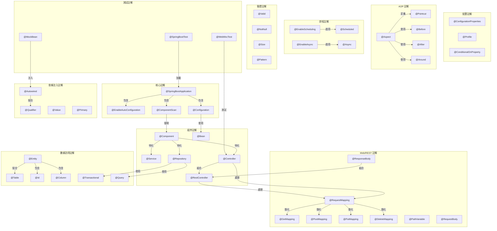
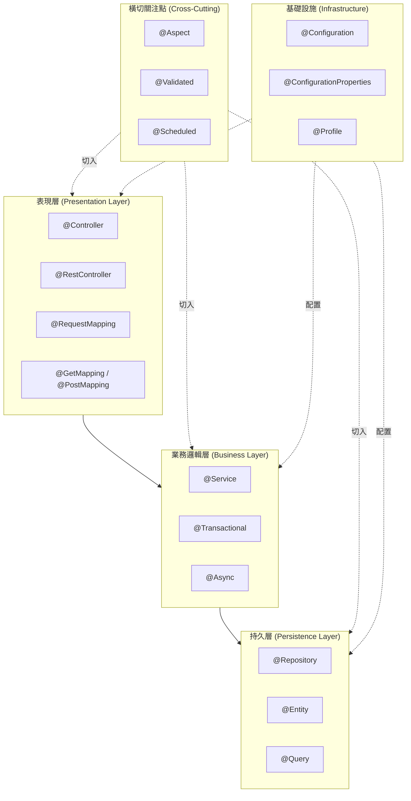
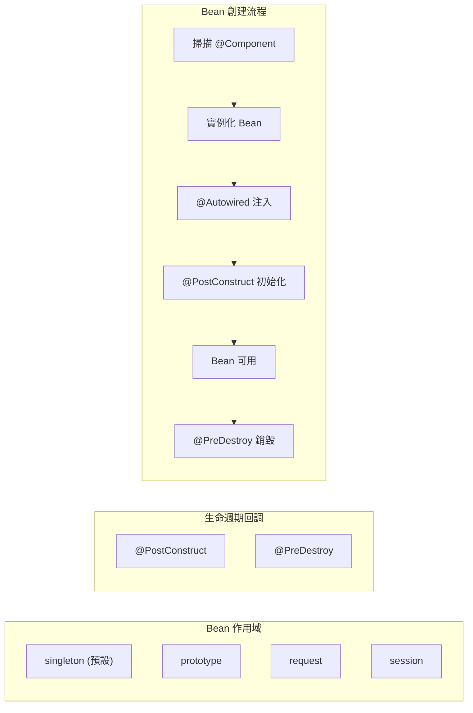

# Spring Boot Learning

Spring Boot 學習專案，採用 Gradle 多模組架構，包含多個獨立的學習範例。

## 專案結構

```
spring-boot-learning/
├── spring-boot-basics/       # Spring Boot 基礎 - 電子商務 REST API 範例
├── spring-security-demo/     # Spring Security - JWT 認證範例
├── build.gradle              # 根專案 Gradle 配置
├── settings.gradle           # 模組配置
└── README.md                 # 本文件
```

## 環境需求

- Java 17+
- Gradle 8.5+

## 子模組說明

### [spring-boot-basics](./spring-boot-basics/README.md)

電子商務 REST API 範例，展示 Spring Boot 的基礎功能：

- RESTful API 設計與實作
- JPA/Hibernate 資料持久層
- Bean Validation 請求驗證
- Exception Handling 全域異常處理
- Swagger/OpenAPI 文檔

**啟動**：`./gradlew :spring-boot-basics:bootRun`（Port 8080）

### [spring-security-demo](./spring-security-demo/README.md)

Spring Security 安全框架範例，展示認證與授權機制：

- JWT Token 認證
- 角色基礎存取控制 (RBAC)
- 方法級安全 (`@PreAuthorize`)
- BCrypt 密碼加密

**啟動**：`./gradlew :spring-security-demo:bootRun`（Port 8081）

## 快速開始

```bash
# 編譯所有模組
./gradlew build

# 執行所有測試
./gradlew test

# 啟動特定模組
./gradlew :spring-boot-basics:bootRun
./gradlew :spring-security-demo:bootRun
```

## 相關資源

- [Spring Boot 官方文檔](https://spring.io/projects/spring-boot)

---

# Spring Boot Annotation 分類總覽

以下整理 Spring Boot 中常用的 Annotation（註解）分類及其功能說明，供學習參考。

---

## 目錄

1. [核心註解 (Core Annotations)](#1-核心註解-core-annotations)
2. [組件註解 (Component Annotations)](#2-組件註解-component-annotations)
3. [依賴注入註解 (Dependency Injection Annotations)](#3-依賴注入註解-dependency-injection-annotations)
4. [Web/REST 註解 (Web/REST Annotations)](#4-webrest-註解-webrest-annotations)
5. [數據訪問註解 (Data Access Annotations)](#5-數據訪問註解-data-access-annotations)
6. [配置相關註解 (Configuration Annotations)](#6-配置相關註解-configuration-annotations)
7. [AOP 註解 (Aspect-Oriented Programming Annotations)](#7-aop-註解-aspect-oriented-programming-annotations)
8. [排程註解 (Scheduling Annotations)](#8-排程註解-scheduling-annotations)
9. [驗證註解 (Validation Annotations)](#9-驗證註解-validation-annotations)
10. [測試註解 (Testing Annotations)](#10-測試註解-testing-annotations)

---

## 1. 核心註解 (Core Annotations)

用於啟動和配置 Spring Boot 應用程式的基礎註解。

| 註解 | 功能說明 |
|------|----------|
| `@SpringBootApplication` | 組合註解，包含 `@Configuration`、`@EnableAutoConfiguration`、`@ComponentScan`，是 Spring Boot 應用的入口點 |
| `@EnableAutoConfiguration` | 啟用 Spring Boot 的自動配置機制，根據 classpath 中的依賴自動配置 Bean |
| `@ComponentScan` | 指定 Spring 掃描組件的包路徑，自動發現和註冊 Bean |
| `@Configuration` | 標記類為配置類，可定義 Bean，等同於 XML 配置文件 |

### 程式碼範例

```java
// ========== 電商應用程式入口 ==========
@SpringBootApplication
@ComponentScan(basePackages = {"com.ecommerce"})
public class ECommerceApplication {
    public static void main(String[] args) {
        SpringApplication.run(ECommerceApplication.class, args);
    }
}

// ========== 自訂配置類 ==========
@Configuration
@EnableAutoConfiguration(exclude = {DataSourceAutoConfiguration.class})
public class AppConfig {

    @Bean
    public ModelMapper modelMapper() {
        return new ModelMapper();
    }

    @Bean
    public PasswordEncoder passwordEncoder() {
        return new BCryptPasswordEncoder();
    }
}
```

---

## 2. 組件註解 (Component Annotations)

用於定義和標記不同類型的 Spring 管理組件。

| 註解 | 功能說明 |
|------|----------|
| `@Component` | 通用組件標記，將類標記為 Spring 管理的 Bean |
| `@Service` | 標記業務邏輯層組件，語義化的 `@Component` |
| `@Repository` | 標記數據訪問層組件，提供數據庫異常轉換功能 |
| `@Controller` | 標記 MVC 控制器，處理 HTTP 請求並返回視圖 |
| `@RestController` | 組合 `@Controller` 和 `@ResponseBody`，專用於 RESTful API |
| `@Bean` | 在 `@Configuration` 類中定義方法級別的 Bean |

### 程式碼範例

```java
// ========== 商品服務 (Service 層) ==========
@Service
public class ProductService {

    private final ProductRepository productRepository;

    public ProductService(ProductRepository productRepository) {
        this.productRepository = productRepository;
    }

    public List<Product> getAllProducts() {
        return productRepository.findAll();
    }

    public Product getProductById(Long id) {
        return productRepository.findById(id)
            .orElseThrow(() -> new ProductNotFoundException("商品不存在: " + id));
    }
}

// ========== 商品倉儲 (Repository 層) ==========
@Repository
public interface ProductRepository extends JpaRepository<Product, Long> {
    List<Product> findByCategory(String category);
    List<Product> findByPriceBetween(BigDecimal minPrice, BigDecimal maxPrice);
}

// ========== 商品控制器 (Controller 層) ==========
@Controller
@RequestMapping("/products")
public class ProductViewController {

    @Autowired
    private ProductService productService;

    @GetMapping
    public String listProducts(Model model) {
        model.addAttribute("products", productService.getAllProducts());
        return "product/list";  // 返回視圖名稱
    }
}

// ========== RESTful API 控制器 ==========
@RestController
@RequestMapping("/api/products")
public class ProductApiController {

    @Autowired
    private ProductService productService;

    @GetMapping
    public ResponseEntity<List<Product>> getAllProducts() {
        return ResponseEntity.ok(productService.getAllProducts());
    }
}

// ========== 通用組件 (工具類) ==========
@Component
public class PriceCalculator {

    public BigDecimal calculateDiscount(BigDecimal price, int discountPercent) {
        BigDecimal discount = price.multiply(BigDecimal.valueOf(discountPercent))
            .divide(BigDecimal.valueOf(100));
        return price.subtract(discount);
    }
}
```

---

## 3. 依賴注入註解 (Dependency Injection Annotations)

用於實現控制反轉（IoC）和依賴注入（DI）。

| 註解 | 功能說明 |
|------|----------|
| `@Autowired` | 自動裝配依賴，按類型注入 Bean |
| `@Qualifier` | 配合 `@Autowired` 使用，指定注入特定名稱的 Bean |
| `@Value` | 注入配置文件中的屬性值或 SpEL 表達式結果 |
| `@Resource` | JSR-250 標準註解，按名稱注入 Bean |
| `@Inject` | JSR-330 標準註解，功能類似 `@Autowired` |
| `@Primary` | 當有多個候選 Bean 時，標記優先注入的 Bean |
| `@Lazy` | 延遲初始化 Bean，在首次使用時才創建 |

### 程式碼範例

```java
// ========== 訂單服務 - 展示多種依賴注入方式 ==========
@Service
public class OrderService {

    // 方式一：@Autowired 欄位注入
    @Autowired
    private ProductService productService;

    // 方式二：使用 @Qualifier 指定特定的 Bean
    @Autowired
    @Qualifier("creditCardPayment")
    private PaymentService paymentService;

    // 方式三：@Value 注入配置值
    @Value("${order.max-items:100}")
    private int maxOrderItems;

    @Value("${order.tax-rate:0.05}")
    private double taxRate;

    // 方式四：建構子注入（推薦方式）
    private final InventoryService inventoryService;
    private final NotificationService notificationService;

    public OrderService(InventoryService inventoryService,
                        NotificationService notificationService) {
        this.inventoryService = inventoryService;
        this.notificationService = notificationService;
    }

    public Order createOrder(OrderRequest request) {
        // 使用注入的服務
        Product product = productService.getProductById(request.getProductId());
        inventoryService.reserveStock(product.getId(), request.getQuantity());
        return new Order(product, request.getQuantity());
    }
}

// ========== 支付服務介面與多實現 ==========
public interface PaymentService {
    PaymentResult process(BigDecimal amount);
}

@Service("creditCardPayment")
@Primary  // 當有多個實現時，優先使用此 Bean
public class CreditCardPaymentService implements PaymentService {
    @Override
    public PaymentResult process(BigDecimal amount) {
        // 信用卡支付邏輯
        return new PaymentResult(true, "信用卡支付成功");
    }
}

@Service("linePayPayment")
public class LinePayPaymentService implements PaymentService {
    @Override
    public PaymentResult process(BigDecimal amount) {
        // LINE Pay 支付邏輯
        return new PaymentResult(true, "LINE Pay 支付成功");
    }
}

// ========== 延遲載入的報表服務 ==========
@Service
@Lazy  // 延遲初始化，首次使用時才創建
public class ReportService {

    public ReportService() {
        System.out.println("ReportService 初始化 - 載入大量資源...");
    }

    public Report generateSalesReport(LocalDate startDate, LocalDate endDate) {
        // 生成銷售報表
        return new Report();
    }
}
```

---

## 4. Web/REST 註解 (Web/REST Annotations)

用於處理 HTTP 請求和構建 RESTful API。

| 註解 | 功能說明 |
|------|----------|
| `@RequestMapping` | 映射 HTTP 請求到處理方法，可指定路徑、方法、參數等 |
| `@GetMapping` | 處理 HTTP GET 請求，`@RequestMapping(method=GET)` 的簡寫 |
| `@PostMapping` | 處理 HTTP POST 請求 |
| `@PutMapping` | 處理 HTTP PUT 請求 |
| `@DeleteMapping` | 處理 HTTP DELETE 請求 |
| `@PatchMapping` | 處理 HTTP PATCH 請求 |
| `@PathVariable` | 從 URL 路徑中提取變數值 |
| `@RequestParam` | 獲取 URL 查詢參數或表單參數 |
| `@RequestBody` | 將 HTTP 請求體綁定到方法參數（通常用於 JSON） |
| `@ResponseBody` | 將方法返回值直接作為 HTTP 響應體 |
| `@ResponseStatus` | 指定方法返回的 HTTP 狀態碼 |
| `@RequestHeader` | 獲取 HTTP 請求頭的值 |
| `@CookieValue` | 獲取 Cookie 的值 |
| `@CrossOrigin` | 啟用跨域資源共享（CORS） |

### 程式碼範例

```java
// ========== 商品 API 控制器 - 完整 CRUD 範例 ==========
@RestController
@RequestMapping("/api/v1/products")
@CrossOrigin(origins = "http://localhost:3000")  // 允許前端跨域存取
public class ProductApiController {

    @Autowired
    private ProductService productService;

    // GET /api/v1/products - 取得所有商品（支援分頁與篩選）
    @GetMapping
    public ResponseEntity<Page<ProductDTO>> getProducts(
            @RequestParam(defaultValue = "0") int page,
            @RequestParam(defaultValue = "10") int size,
            @RequestParam(required = false) String category,
            @RequestParam(required = false) BigDecimal minPrice,
            @RequestParam(required = false) BigDecimal maxPrice) {

        Page<ProductDTO> products = productService.findProducts(
            page, size, category, minPrice, maxPrice);
        return ResponseEntity.ok(products);
    }

    // GET /api/v1/products/{id} - 取得單一商品
    @GetMapping("/{id}")
    public ResponseEntity<ProductDTO> getProduct(@PathVariable Long id) {
        ProductDTO product = productService.getProductById(id);
        return ResponseEntity.ok(product);
    }

    // POST /api/v1/products - 新增商品
    @PostMapping
    @ResponseStatus(HttpStatus.CREATED)
    public ProductDTO createProduct(@Valid @RequestBody CreateProductRequest request) {
        return productService.createProduct(request);
    }

    // PUT /api/v1/products/{id} - 更新商品
    @PutMapping("/{id}")
    public ResponseEntity<ProductDTO> updateProduct(
            @PathVariable Long id,
            @Valid @RequestBody UpdateProductRequest request) {
        ProductDTO updated = productService.updateProduct(id, request);
        return ResponseEntity.ok(updated);
    }

    // PATCH /api/v1/products/{id}/price - 部分更新（僅更新價格）
    @PatchMapping("/{id}/price")
    public ResponseEntity<ProductDTO> updatePrice(
            @PathVariable Long id,
            @RequestBody Map<String, BigDecimal> priceUpdate) {
        ProductDTO updated = productService.updatePrice(id, priceUpdate.get("price"));
        return ResponseEntity.ok(updated);
    }

    // DELETE /api/v1/products/{id} - 刪除商品
    @DeleteMapping("/{id}")
    @ResponseStatus(HttpStatus.NO_CONTENT)
    public void deleteProduct(@PathVariable Long id) {
        productService.deleteProduct(id);
    }
}

// ========== 購物車 API 控制器 - 展示更多註解用法 ==========
@RestController
@RequestMapping("/api/v1/cart")
public class CartApiController {

    @Autowired
    private CartService cartService;

    // 從請求頭獲取用戶 Token
    @GetMapping
    public ResponseEntity<CartDTO> getCart(
            @RequestHeader("Authorization") String authToken) {
        CartDTO cart = cartService.getCartByToken(authToken);
        return ResponseEntity.ok(cart);
    }

    // 從 Cookie 獲取購物車 ID
    @GetMapping("/anonymous")
    public ResponseEntity<CartDTO> getAnonymousCart(
            @CookieValue(value = "cart_id", defaultValue = "") String cartId) {
        if (cartId.isEmpty()) {
            return ResponseEntity.ok(new CartDTO());
        }
        return ResponseEntity.ok(cartService.getCartById(cartId));
    }

    // 加入購物車
    @PostMapping("/items")
    public ResponseEntity<CartDTO> addToCart(
            @RequestHeader("Authorization") String authToken,
            @RequestBody AddToCartRequest request) {
        CartDTO cart = cartService.addItem(authToken, request);
        return ResponseEntity.ok(cart);
    }
}

// ========== DTO 請求類別 ==========
public class CreateProductRequest {
    @NotBlank(message = "商品名稱不能為空")
    private String name;

    @NotNull(message = "價格不能為空")
    @Min(value = 0, message = "價格不能為負數")
    private BigDecimal price;

    private String description;
    private String category;

    // getters and setters
}
```

---

## 5. 數據訪問註解 (Data Access Annotations)

用於 ORM 映射和數據庫操作。

| 註解 | 功能說明 |
|------|----------|
| `@Entity` | 標記類為 JPA 實體，對應數據庫表 |
| `@Table` | 指定實體對應的數據庫表名 |
| `@Id` | 標記實體的主鍵字段 |
| `@GeneratedValue` | 指定主鍵的生成策略 |
| `@Column` | 指定字段對應的數據庫列屬性 |
| `@Transactional` | 聲明方法或類使用事務管理 |
| `@Query` | 在 Repository 中定義自定義查詢語句 |
| `@Modifying` | 標記 `@Query` 為更新/刪除操作 |
| `@OneToMany` | 定義一對多關聯關係 |
| `@ManyToOne` | 定義多對一關聯關係 |
| `@ManyToMany` | 定義多對多關聯關係 |
| `@JoinColumn` | 指定外鍵列 |

### 程式碼範例

```java
// ========== 商品實體 ==========
@Entity
@Table(name = "products")
public class Product {

    @Id
    @GeneratedValue(strategy = GenerationType.IDENTITY)
    private Long id;

    @Column(name = "product_name", nullable = false, length = 200)
    private String name;

    @Column(precision = 10, scale = 2)
    private BigDecimal price;

    @Column(columnDefinition = "TEXT")
    private String description;

    @Column(name = "stock_quantity")
    private Integer stockQuantity;

    @ManyToOne(fetch = FetchType.LAZY)
    @JoinColumn(name = "category_id")
    private Category category;

    @OneToMany(mappedBy = "product", cascade = CascadeType.ALL)
    private List<OrderItem> orderItems = new ArrayList<>();

    @CreatedDate
    @Column(name = "created_at", updatable = false)
    private LocalDateTime createdAt;

    @LastModifiedDate
    @Column(name = "updated_at")
    private LocalDateTime updatedAt;

    // getters and setters
}

// ========== 訂單實體 ==========
@Entity
@Table(name = "orders")
public class Order {

    @Id
    @GeneratedValue(strategy = GenerationType.IDENTITY)
    private Long id;

    @Column(name = "order_number", unique = true)
    private String orderNumber;

    @ManyToOne(fetch = FetchType.LAZY)
    @JoinColumn(name = "user_id", nullable = false)
    private User user;

    @OneToMany(mappedBy = "order", cascade = CascadeType.ALL, orphanRemoval = true)
    private List<OrderItem> items = new ArrayList<>();

    @Enumerated(EnumType.STRING)
    @Column(name = "status")
    private OrderStatus status;

    @Column(name = "total_amount", precision = 10, scale = 2)
    private BigDecimal totalAmount;

    // getters and setters
}

// ========== 訂單項目實體（多對多中間表） ==========
@Entity
@Table(name = "order_items")
public class OrderItem {

    @Id
    @GeneratedValue(strategy = GenerationType.IDENTITY)
    private Long id;

    @ManyToOne(fetch = FetchType.LAZY)
    @JoinColumn(name = "order_id")
    private Order order;

    @ManyToOne(fetch = FetchType.LAZY)
    @JoinColumn(name = "product_id")
    private Product product;

    @Column(nullable = false)
    private Integer quantity;

    @Column(name = "unit_price", precision = 10, scale = 2)
    private BigDecimal unitPrice;

    // getters and setters
}

// ========== 商品倉儲 - 自定義查詢 ==========
@Repository
public interface ProductRepository extends JpaRepository<Product, Long> {

    // 方法名稱查詢
    List<Product> findByNameContaining(String keyword);

    List<Product> findByCategoryIdAndPriceLessThan(Long categoryId, BigDecimal maxPrice);

    // @Query 自定義 JPQL 查詢
    @Query("SELECT p FROM Product p WHERE p.stockQuantity < :threshold")
    List<Product> findLowStockProducts(@Param("threshold") int threshold);

    @Query("SELECT p FROM Product p WHERE p.category.name = :categoryName ORDER BY p.price DESC")
    List<Product> findByCategoryNameOrderByPriceDesc(@Param("categoryName") String categoryName);

    // 原生 SQL 查詢
    @Query(value = "SELECT * FROM products WHERE created_at >= :startDate", nativeQuery = true)
    List<Product> findNewProducts(@Param("startDate") LocalDateTime startDate);

    // 更新操作
    @Modifying
    @Query("UPDATE Product p SET p.price = p.price * :multiplier WHERE p.category.id = :categoryId")
    int updatePricesByCategory(@Param("categoryId") Long categoryId, @Param("multiplier") BigDecimal multiplier);

    // 刪除操作
    @Modifying
    @Query("DELETE FROM Product p WHERE p.stockQuantity = 0 AND p.updatedAt < :cutoffDate")
    int deleteOutOfStockProducts(@Param("cutoffDate") LocalDateTime cutoffDate);
}

// ========== 訂單服務 - 事務管理 ==========
@Service
public class OrderService {

    @Autowired
    private OrderRepository orderRepository;

    @Autowired
    private ProductRepository productRepository;

    @Autowired
    private InventoryService inventoryService;

    @Transactional  // 整個方法在同一個事務中執行
    public Order createOrder(CreateOrderRequest request) {
        Order order = new Order();
        order.setOrderNumber(generateOrderNumber());
        order.setStatus(OrderStatus.PENDING);

        for (OrderItemRequest itemRequest : request.getItems()) {
            Product product = productRepository.findById(itemRequest.getProductId())
                .orElseThrow(() -> new ProductNotFoundException("商品不存在"));

            // 扣減庫存（如果失敗，整個訂單創建會回滾）
            inventoryService.decreaseStock(product.getId(), itemRequest.getQuantity());

            OrderItem item = new OrderItem();
            item.setProduct(product);
            item.setQuantity(itemRequest.getQuantity());
            item.setUnitPrice(product.getPrice());
            order.addItem(item);
        }

        order.calculateTotal();
        return orderRepository.save(order);
    }

    @Transactional(readOnly = true)  // 唯讀事務，優化性能
    public Order getOrderById(Long id) {
        return orderRepository.findById(id)
            .orElseThrow(() -> new OrderNotFoundException("訂單不存在"));
    }

    @Transactional(rollbackFor = Exception.class)  // 任何異常都回滾
    public void cancelOrder(Long orderId) {
        Order order = getOrderById(orderId);
        order.setStatus(OrderStatus.CANCELLED);

        // 恢復庫存
        for (OrderItem item : order.getItems()) {
            inventoryService.increaseStock(item.getProduct().getId(), item.getQuantity());
        }

        orderRepository.save(order);
    }
}
```

---

## 6. 配置相關註解 (Configuration Annotations)

用於外部化配置和條件化 Bean 創建。

| 註解 | 功能說明 |
|------|----------|
| `@ConfigurationProperties` | 將配置文件屬性綁定到 Bean |
| `@EnableConfigurationProperties` | 啟用 `@ConfigurationProperties` 註解的類 |
| `@PropertySource` | 指定額外的屬性文件來源 |
| `@Profile` | 指定 Bean 在特定環境（dev/test/prod）下生效 |
| `@Conditional` | 根據條件決定是否創建 Bean |
| `@ConditionalOnProperty` | 根據配置屬性決定是否創建 Bean |
| `@ConditionalOnClass` | 當 classpath 存在指定類時創建 Bean |
| `@ConditionalOnMissingBean` | 當容器中不存在指定 Bean 時創建 |

### 程式碼範例

```java
// ========== application.yml 配置文件 ==========
/*
payment:
  gateway:
    provider: stripe
    api-key: sk_test_xxxx
    api-secret: sk_secret_xxxx
    timeout: 30000
    retry-attempts: 3
  supported-currencies:
    - TWD
    - USD
    - JPY
*/

// ========== 支付配置屬性類 ==========
@Configuration
@ConfigurationProperties(prefix = "payment.gateway")
@Validated
public class PaymentGatewayProperties {

    @NotBlank
    private String provider;

    @NotBlank
    private String apiKey;

    private String apiSecret;

    @Min(1000)
    @Max(60000)
    private int timeout = 30000;

    @Min(1)
    @Max(5)
    private int retryAttempts = 3;

    // getters and setters
}

// ========== 啟用配置屬性 ==========
@Configuration
@EnableConfigurationProperties(PaymentGatewayProperties.class)
public class PaymentConfig {

    @Bean
    public PaymentGateway paymentGateway(PaymentGatewayProperties properties) {
        return new PaymentGateway(
            properties.getProvider(),
            properties.getApiKey(),
            properties.getTimeout()
        );
    }
}

// ========== 環境特定配置 ==========
@Configuration
@Profile("dev")  // 僅在開發環境生效
public class DevConfig {

    @Bean
    public DataSource dataSource() {
        // H2 內存數據庫
        return new EmbeddedDatabaseBuilder()
            .setType(EmbeddedDatabaseType.H2)
            .build();
    }
}

@Configuration
@Profile("prod")  // 僅在生產環境生效
public class ProdConfig {

    @Bean
    public DataSource dataSource() {
        HikariDataSource dataSource = new HikariDataSource();
        dataSource.setJdbcUrl("jdbc:mysql://prod-db:3306/ecommerce");
        dataSource.setMaximumPoolSize(20);
        return dataSource;
    }
}

// ========== 條件化配置 ==========
@Configuration
public class CacheConfig {

    // 當配置了 cache.type=redis 時才創建
    @Bean
    @ConditionalOnProperty(name = "cache.type", havingValue = "redis")
    public CacheManager redisCacheManager(RedisConnectionFactory factory) {
        return RedisCacheManager.builder(factory).build();
    }

    // 當 classpath 中有 Caffeine 類時才創建
    @Bean
    @ConditionalOnClass(name = "com.github.benmanes.caffeine.cache.Caffeine")
    @ConditionalOnMissingBean(CacheManager.class)  // 且沒有其他 CacheManager
    public CacheManager caffeineCacheManager() {
        CaffeineCacheManager manager = new CaffeineCacheManager();
        manager.setCaffeine(Caffeine.newBuilder()
            .maximumSize(1000)
            .expireAfterWrite(Duration.ofMinutes(10)));
        return manager;
    }
}

// ========== 外部屬性文件 ==========
@Configuration
@PropertySource("classpath:payment-${spring.profiles.active}.properties")
public class ExternalPropertyConfig {
    // 從外部文件載入配置
}

// ========== 自訂條件 ==========
public class OnProductionDatabaseCondition implements Condition {
    @Override
    public boolean matches(ConditionContext context, AnnotatedTypeMetadata metadata) {
        String dbType = context.getEnvironment().getProperty("database.type");
        return "production".equals(dbType);
    }
}

@Configuration
public class DatabaseConfig {

    @Bean
    @Conditional(OnProductionDatabaseCondition.class)
    public DatabaseMigrationService migrationService() {
        return new DatabaseMigrationService();
    }
}
```

---

## 7. AOP 註解 (Aspect-Oriented Programming Annotations)

用於實現面向切面編程，處理橫切關注點。

| 註解 | 功能說明 |
|------|----------|
| `@Aspect` | 標記類為切面類 |
| `@Pointcut` | 定義切入點表達式 |
| `@Before` | 在目標方法執行前執行通知 |
| `@After` | 在目標方法執行後執行通知（無論是否異常） |
| `@AfterReturning` | 在目標方法正常返回後執行通知 |
| `@AfterThrowing` | 在目標方法拋出異常後執行通知 |
| `@Around` | 環繞通知，完全控制目標方法的執行 |

### 程式碼範例

```java
// ========== 訂單操作日誌切面 ==========
@Aspect
@Component
@Slf4j
public class OrderLoggingAspect {

    // 定義切入點：所有 OrderService 的方法
    @Pointcut("execution(* com.ecommerce.service.OrderService.*(..))")
    public void orderServiceMethods() {}

    // 定義切入點：所有帶有 @Transactional 註解的方法
    @Pointcut("@annotation(org.springframework.transaction.annotation.Transactional)")
    public void transactionalMethods() {}

    // 前置通知：方法執行前記錄
    @Before("orderServiceMethods()")
    public void logBefore(JoinPoint joinPoint) {
        String methodName = joinPoint.getSignature().getName();
        Object[] args = joinPoint.getArgs();
        log.info("準備執行訂單操作: {} 參數: {}", methodName, Arrays.toString(args));
    }

    // 後置通知：方法正常返回後記錄
    @AfterReturning(pointcut = "orderServiceMethods()", returning = "result")
    public void logAfterReturning(JoinPoint joinPoint, Object result) {
        String methodName = joinPoint.getSignature().getName();
        log.info("訂單操作完成: {} 結果: {}", methodName, result);
    }

    // 異常通知：方法拋出異常時記錄
    @AfterThrowing(pointcut = "orderServiceMethods()", throwing = "exception")
    public void logAfterThrowing(JoinPoint joinPoint, Throwable exception) {
        String methodName = joinPoint.getSignature().getName();
        log.error("訂單操作失敗: {} 異常: {}", methodName, exception.getMessage());
    }

    // 最終通知：無論成功或失敗都執行
    @After("orderServiceMethods()")
    public void logAfter(JoinPoint joinPoint) {
        log.debug("訂單操作執行結束: {}", joinPoint.getSignature().getName());
    }
}

// ========== API 性能監控切面 ==========
@Aspect
@Component
@Slf4j
public class PerformanceMonitorAspect {

    // 環繞通知：完全控制方法執行
    @Around("execution(* com.ecommerce.controller.*.*(..))")
    public Object measureExecutionTime(ProceedingJoinPoint joinPoint) throws Throwable {
        long startTime = System.currentTimeMillis();

        String className = joinPoint.getTarget().getClass().getSimpleName();
        String methodName = joinPoint.getSignature().getName();

        try {
            // 執行目標方法
            Object result = joinPoint.proceed();

            long executionTime = System.currentTimeMillis() - startTime;
            log.info("API 執行時間: {}.{} = {}ms", className, methodName, executionTime);

            // 如果執行時間超過閾值，發出警告
            if (executionTime > 1000) {
                log.warn("API 響應緩慢: {}.{} 耗時 {}ms", className, methodName, executionTime);
            }

            return result;
        } catch (Throwable e) {
            long executionTime = System.currentTimeMillis() - startTime;
            log.error("API 執行異常: {}.{} 耗時 {}ms 異常: {}",
                className, methodName, executionTime, e.getMessage());
            throw e;
        }
    }
}

// ========== 庫存檢查切面 ==========
@Aspect
@Component
public class InventoryCheckAspect {

    @Autowired
    private InventoryService inventoryService;

    // 在加入購物車前檢查庫存
    @Before("execution(* com.ecommerce.service.CartService.addItem(..)) && args(userId, productId, quantity)")
    public void checkInventoryBeforeAddToCart(Long userId, Long productId, int quantity) {
        int availableStock = inventoryService.getAvailableStock(productId);
        if (availableStock < quantity) {
            throw new InsufficientStockException(
                "庫存不足，商品ID: " + productId + " 可用庫存: " + availableStock
            );
        }
    }
}

// ========== 自訂註解的切面 ==========
// 自訂審計註解
@Target(ElementType.METHOD)
@Retention(RetentionPolicy.RUNTIME)
public @interface Auditable {
    String action();
}

@Aspect
@Component
public class AuditAspect {

    @Autowired
    private AuditLogRepository auditLogRepository;

    @Around("@annotation(auditable)")
    public Object audit(ProceedingJoinPoint joinPoint, Auditable auditable) throws Throwable {
        String action = auditable.action();
        String username = SecurityContextHolder.getContext().getAuthentication().getName();

        AuditLog log = new AuditLog();
        log.setAction(action);
        log.setUsername(username);
        log.setTimestamp(LocalDateTime.now());

        try {
            Object result = joinPoint.proceed();
            log.setStatus("SUCCESS");
            return result;
        } catch (Throwable e) {
            log.setStatus("FAILED");
            log.setErrorMessage(e.getMessage());
            throw e;
        } finally {
            auditLogRepository.save(log);
        }
    }
}

// 使用自訂審計註解
@Service
public class OrderService {

    @Auditable(action = "CREATE_ORDER")
    @Transactional
    public Order createOrder(CreateOrderRequest request) {
        // 創建訂單邏輯
    }

    @Auditable(action = "CANCEL_ORDER")
    @Transactional
    public void cancelOrder(Long orderId) {
        // 取消訂單邏輯
    }
}
```

---

## 8. 排程註解 (Scheduling Annotations)

用於定時任務和異步處理。

| 註解 | 功能說明 |
|------|----------|
| `@EnableScheduling` | 啟用定時任務功能 |
| `@Scheduled` | 標記方法為定時任務，支持 cron、fixedRate、fixedDelay |
| `@EnableAsync` | 啟用異步方法執行功能 |
| `@Async` | 標記方法為異步執行，在獨立線程中運行 |

### 程式碼範例

```java
// ========== 啟用排程和異步功能 ==========
@SpringBootApplication
@EnableScheduling   // 啟用定時任務
@EnableAsync        // 啟用異步方法
public class ECommerceApplication {
    public static void main(String[] args) {
        SpringApplication.run(ECommerceApplication.class, args);
    }
}

// ========== 定時任務服務 ==========
@Service
@Slf4j
public class ScheduledTaskService {

    @Autowired
    private OrderRepository orderRepository;

    @Autowired
    private InventoryService inventoryService;

    @Autowired
    private NotificationService notificationService;

    // 每天凌晨 2 點執行 - 取消超時未付款訂單
    @Scheduled(cron = "0 0 2 * * ?")
    public void cancelUnpaidOrders() {
        log.info("開始處理超時未付款訂單...");
        LocalDateTime cutoffTime = LocalDateTime.now().minusHours(24);

        List<Order> unpaidOrders = orderRepository
            .findByStatusAndCreatedAtBefore(OrderStatus.PENDING, cutoffTime);

        for (Order order : unpaidOrders) {
            order.setStatus(OrderStatus.CANCELLED);
            // 恢復庫存
            inventoryService.restoreStock(order);
            orderRepository.save(order);
            log.info("已取消超時訂單: {}", order.getOrderNumber());
        }

        log.info("超時訂單處理完成，共取消 {} 筆訂單", unpaidOrders.size());
    }

    // 每 5 分鐘執行一次 - 檢查低庫存商品
    @Scheduled(fixedRate = 300000)  // 300000ms = 5分鐘
    public void checkLowStockProducts() {
        log.info("檢查低庫存商品...");
        List<Product> lowStockProducts = inventoryService.findLowStockProducts(10);

        if (!lowStockProducts.isEmpty()) {
            notificationService.notifyLowStock(lowStockProducts);
        }
    }

    // 每 10 秒執行一次（上次執行完成後等 10 秒再執行）
    @Scheduled(fixedDelay = 10000)
    public void processPaymentCallbacks() {
        log.debug("處理支付回調...");
        // 處理待處理的支付回調
    }

    // 啟動後延遲 30 秒開始，然後每分鐘執行
    @Scheduled(initialDelay = 30000, fixedRate = 60000)
    public void syncInventoryWithWarehouse() {
        log.info("同步倉庫庫存數據...");
        // 與倉庫系統同步庫存
    }

    // 使用 cron 表達式：每週一上午 9 點發送週報
    @Scheduled(cron = "0 0 9 * * MON")
    public void sendWeeklySalesReport() {
        log.info("生成並發送週銷售報表...");
        // 生成報表並發送
    }
}

// ========== 異步服務 ==========
@Service
@Slf4j
public class AsyncNotificationService {

    @Autowired
    private EmailService emailService;

    @Autowired
    private SmsService smsService;

    @Autowired
    private PushNotificationService pushService;

    // 異步發送訂單確認郵件
    @Async
    public void sendOrderConfirmationEmail(Order order) {
        log.info("異步發送訂單確認郵件: {}", order.getOrderNumber());
        emailService.sendOrderConfirmation(order.getUser().getEmail(), order);
    }

    // 異步發送短信通知
    @Async
    public void sendShipmentSms(Order order, String trackingNumber) {
        log.info("異步發送出貨短信: {}", order.getOrderNumber());
        smsService.sendShipmentNotification(
            order.getUser().getPhone(),
            order.getOrderNumber(),
            trackingNumber
        );
    }

    // 異步方法返回 Future，可獲取執行結果
    @Async
    public CompletableFuture<Boolean> sendPromotionNotifications(List<User> users, Promotion promotion) {
        log.info("開始發送促銷通知給 {} 位用戶", users.size());

        int successCount = 0;
        for (User user : users) {
            try {
                pushService.sendPromotion(user, promotion);
                successCount++;
            } catch (Exception e) {
                log.error("發送促銷通知失敗: userId={}", user.getId(), e);
            }
        }

        log.info("促銷通知發送完成: 成功 {}/{}", successCount, users.size());
        return CompletableFuture.completedFuture(successCount == users.size());
    }
}

// ========== 異步配置 ==========
@Configuration
@EnableAsync
public class AsyncConfig implements AsyncConfigurer {

    @Override
    @Bean(name = "taskExecutor")
    public Executor getAsyncExecutor() {
        ThreadPoolTaskExecutor executor = new ThreadPoolTaskExecutor();
        executor.setCorePoolSize(5);
        executor.setMaxPoolSize(10);
        executor.setQueueCapacity(100);
        executor.setThreadNamePrefix("Async-");
        executor.setRejectedExecutionHandler(new ThreadPoolExecutor.CallerRunsPolicy());
        executor.initialize();
        return executor;
    }

    @Override
    public AsyncUncaughtExceptionHandler getAsyncUncaughtExceptionHandler() {
        return (throwable, method, params) -> {
            log.error("異步方法執行異常: {} 參數: {}", method.getName(), Arrays.toString(params), throwable);
        };
    }
}

// ========== 使用異步服務 ==========
@Service
public class OrderService {

    @Autowired
    private AsyncNotificationService notificationService;

    @Transactional
    public Order createOrder(CreateOrderRequest request) {
        Order order = // ... 創建訂單邏輯

        // 異步發送通知（不阻塞主流程）
        notificationService.sendOrderConfirmationEmail(order);

        return order;
    }
}
```

---

## 9. 驗證註解 (Validation Annotations)

用於數據校驗（基於 JSR-303/JSR-380）。

| 註解 | 功能說明 |
|------|----------|
| `@Valid` | 觸發嵌套對象的驗證 |
| `@Validated` | Spring 的驗證註解，支持分組驗證 |
| `@NotNull` | 驗證值不為 null |
| `@NotEmpty` | 驗證字符串/集合不為空 |
| `@NotBlank` | 驗證字符串不為空且不只包含空白字符 |
| `@Size` | 驗證字符串/集合的長度範圍 |
| `@Min` / `@Max` | 驗證數值的最小/最大值 |
| `@Pattern` | 驗證字符串匹配正則表達式 |
| `@Email` | 驗證電子郵件格式 |

### 程式碼範例

```java
// ========== 用戶註冊請求 DTO ==========
public class UserRegistrationRequest {

    @NotBlank(message = "用戶名不能為空")
    @Size(min = 3, max = 20, message = "用戶名長度必須在 3-20 個字符之間")
    @Pattern(regexp = "^[a-zA-Z0-9_]+$", message = "用戶名只能包含字母、數字和下劃線")
    private String username;

    @NotBlank(message = "密碼不能為空")
    @Size(min = 8, max = 100, message = "密碼長度必須至少 8 個字符")
    @Pattern(regexp = "^(?=.*[a-z])(?=.*[A-Z])(?=.*\\d).*$",
             message = "密碼必須包含大小寫字母和數字")
    private String password;

    @NotBlank(message = "電子郵件不能為空")
    @Email(message = "請輸入有效的電子郵件地址")
    private String email;

    @NotBlank(message = "手機號碼不能為空")
    @Pattern(regexp = "^09\\d{8}$", message = "請輸入有效的台灣手機號碼")
    private String phone;

    @NotNull(message = "請同意服務條款")
    @AssertTrue(message = "必須同意服務條款才能註冊")
    private Boolean agreeToTerms;

    // getters and setters
}

// ========== 創建訂單請求 DTO ==========
public class CreateOrderRequest {

    @NotNull(message = "收貨地址不能為空")
    @Valid  // 觸發嵌套對象的驗證
    private ShippingAddress shippingAddress;

    @NotEmpty(message = "訂單項目不能為空")
    @Size(max = 50, message = "單筆訂單最多 50 件商品")
    @Valid  // 驗證 List 中的每個元素
    private List<OrderItemRequest> items;

    @Pattern(regexp = "^[A-Z0-9]{6,10}$", message = "優惠碼格式不正確")
    private String couponCode;  // 可選欄位

    private String orderNote;
}

// ========== 訂單項目請求 DTO ==========
public class OrderItemRequest {

    @NotNull(message = "商品 ID 不能為空")
    @Positive(message = "商品 ID 必須為正數")
    private Long productId;

    @NotNull(message = "數量不能為空")
    @Min(value = 1, message = "數量至少為 1")
    @Max(value = 99, message = "單項商品數量不能超過 99")
    private Integer quantity;
}

// ========== 收貨地址 DTO ==========
public class ShippingAddress {

    @NotBlank(message = "收件人姓名不能為空")
    @Size(max = 50, message = "姓名不能超過 50 個字符")
    private String recipientName;

    @NotBlank(message = "聯繫電話不能為空")
    private String contactPhone;

    @NotBlank(message = "縣市不能為空")
    private String city;

    @NotBlank(message = "區域不能為空")
    private String district;

    @NotBlank(message = "詳細地址不能為空")
    @Size(max = 200, message = "地址不能超過 200 個字符")
    private String addressLine;

    @Pattern(regexp = "^\\d{3,5}$", message = "郵遞區號格式不正確")
    private String postalCode;
}

// ========== 商品搜尋請求 DTO ==========
public class ProductSearchRequest {

    @Size(max = 100, message = "關鍵字不能超過 100 個字符")
    private String keyword;

    @DecimalMin(value = "0.0", message = "最低價格不能為負數")
    private BigDecimal minPrice;

    @DecimalMax(value = "9999999.99", message = "最高價格超出範圍")
    private BigDecimal maxPrice;

    @Min(value = 0, message = "頁碼不能為負數")
    private Integer page = 0;

    @Min(value = 1, message = "每頁至少 1 筆")
    @Max(value = 100, message = "每頁最多 100 筆")
    private Integer size = 20;
}

// ========== 控制器中使用驗證 ==========
@RestController
@RequestMapping("/api/v1")
@Validated  // 啟用方法參數驗證
public class UserController {

    @Autowired
    private UserService userService;

    // @Valid 觸發 RequestBody 的驗證
    @PostMapping("/users/register")
    public ResponseEntity<UserDTO> register(
            @Valid @RequestBody UserRegistrationRequest request) {
        UserDTO user = userService.register(request);
        return ResponseEntity.status(HttpStatus.CREATED).body(user);
    }

    // @Validated 支持分組驗證
    @PutMapping("/users/{id}")
    public ResponseEntity<UserDTO> updateUser(
            @PathVariable Long id,
            @Validated(UpdateGroup.class) @RequestBody UserUpdateRequest request) {
        UserDTO user = userService.update(id, request);
        return ResponseEntity.ok(user);
    }

    // 驗證路徑參數
    @GetMapping("/users/{id}")
    public ResponseEntity<UserDTO> getUser(
            @PathVariable @Positive(message = "用戶 ID 必須為正數") Long id) {
        return ResponseEntity.ok(userService.getUserById(id));
    }

    // 驗證請求參數
    @GetMapping("/users")
    public ResponseEntity<Page<UserDTO>> searchUsers(
            @RequestParam @Size(min = 2, message = "搜尋關鍵字至少 2 個字符") String keyword,
            @RequestParam(defaultValue = "0") @Min(0) int page,
            @RequestParam(defaultValue = "20") @Min(1) @Max(100) int size) {
        return ResponseEntity.ok(userService.search(keyword, page, size));
    }
}

// ========== 分組驗證介面 ==========
public interface CreateGroup {}
public interface UpdateGroup {}

public class UserUpdateRequest {

    @NotBlank(groups = UpdateGroup.class, message = "用戶名不能為空")
    private String username;

    @Email(groups = UpdateGroup.class, message = "請輸入有效的電子郵件")
    private String email;

    // 更新時密碼可選
    @Size(min = 8, groups = UpdateGroup.class, message = "密碼長度至少 8 個字符")
    private String password;
}

// ========== 自訂驗證註解 ==========
@Target({ElementType.FIELD, ElementType.PARAMETER})
@Retention(RetentionPolicy.RUNTIME)
@Constraint(validatedBy = TaiwanPhoneValidator.class)
public @interface TaiwanPhone {
    String message() default "請輸入有效的台灣手機號碼";
    Class<?>[] groups() default {};
    Class<? extends Payload>[] payload() default {};
}

public class TaiwanPhoneValidator implements ConstraintValidator<TaiwanPhone, String> {

    private static final Pattern PHONE_PATTERN = Pattern.compile("^09\\d{8}$");

    @Override
    public boolean isValid(String value, ConstraintValidatorContext context) {
        if (value == null || value.isEmpty()) {
            return true;  // 使用 @NotBlank 處理空值
        }
        return PHONE_PATTERN.matcher(value).matches();
    }
}

// 使用自訂驗證註解
public class ContactRequest {
    @TaiwanPhone
    private String phone;
}

// ========== 全局異常處理 ==========
@RestControllerAdvice
public class GlobalExceptionHandler {

    @ExceptionHandler(MethodArgumentNotValidException.class)
    public ResponseEntity<Map<String, Object>> handleValidationException(
            MethodArgumentNotValidException ex) {

        Map<String, String> errors = new HashMap<>();
        ex.getBindingResult().getFieldErrors().forEach(error ->
            errors.put(error.getField(), error.getDefaultMessage())
        );

        Map<String, Object> response = new HashMap<>();
        response.put("status", "error");
        response.put("message", "輸入資料驗證失敗");
        response.put("errors", errors);

        return ResponseEntity.badRequest().body(response);
    }
}
```

---

## 10. 測試註解 (Testing Annotations)

用於編寫單元測試和集成測試。

| 註解 | 功能說明 |
|------|----------|
| `@SpringBootTest` | 啟動完整的 Spring 應用上下文進行集成測試 |
| `@WebMvcTest` | 只加載 Web 層組件進行 MVC 測試 |
| `@DataJpaTest` | 只加載 JPA 相關組件進行數據層測試 |
| `@MockBean` | 在測試中創建 Mock 對象並注入到上下文 |
| `@SpyBean` | 創建 Spy 對象，可部分 Mock |
| `@TestConfiguration` | 定義測試專用的配置類 |
| `@BeforeEach` / `@AfterEach` | JUnit 5 的測試生命週期方法 |

### 程式碼範例

```java
// ========== 商品服務單元測試 ==========
@ExtendWith(MockitoExtension.class)  // JUnit 5 使用 Mockito
class ProductServiceTest {

    @Mock
    private ProductRepository productRepository;

    @Mock
    private InventoryService inventoryService;

    @InjectMocks
    private ProductService productService;

    private Product testProduct;

    @BeforeEach
    void setUp() {
        testProduct = new Product();
        testProduct.setId(1L);
        testProduct.setName("測試商品");
        testProduct.setPrice(new BigDecimal("999.00"));
        testProduct.setStockQuantity(100);
    }

    @Test
    @DisplayName("根據 ID 查詢商品 - 成功")
    void getProductById_Success() {
        // Arrange
        when(productRepository.findById(1L)).thenReturn(Optional.of(testProduct));

        // Act
        Product result = productService.getProductById(1L);

        // Assert
        assertNotNull(result);
        assertEquals("測試商品", result.getName());
        verify(productRepository, times(1)).findById(1L);
    }

    @Test
    @DisplayName("根據 ID 查詢商品 - 商品不存在")
    void getProductById_NotFound() {
        // Arrange
        when(productRepository.findById(999L)).thenReturn(Optional.empty());

        // Act & Assert
        assertThrows(ProductNotFoundException.class,
            () -> productService.getProductById(999L));
    }

    @AfterEach
    void tearDown() {
        // 清理測試資源
    }
}

// ========== 商品 API 整合測試 ==========
@SpringBootTest(webEnvironment = SpringBootTest.WebEnvironment.RANDOM_PORT)
@AutoConfigureMockMvc
class ProductApiIntegrationTest {

    @Autowired
    private MockMvc mockMvc;

    @Autowired
    private ObjectMapper objectMapper;

    @MockBean  // 替換 Spring Context 中的 Bean
    private ProductService productService;

    @Test
    @DisplayName("GET /api/v1/products/{id} - 成功取得商品")
    void getProduct_Success() throws Exception {
        // Arrange
        ProductDTO productDTO = new ProductDTO(1L, "iPhone 15", new BigDecimal("35900"));
        when(productService.getProductById(1L)).thenReturn(productDTO);

        // Act & Assert
        mockMvc.perform(get("/api/v1/products/1")
                .contentType(MediaType.APPLICATION_JSON))
            .andExpect(status().isOk())
            .andExpect(jsonPath("$.id").value(1))
            .andExpect(jsonPath("$.name").value("iPhone 15"))
            .andExpect(jsonPath("$.price").value(35900));
    }

    @Test
    @DisplayName("POST /api/v1/products - 創建商品")
    void createProduct_Success() throws Exception {
        // Arrange
        CreateProductRequest request = new CreateProductRequest();
        request.setName("新商品");
        request.setPrice(new BigDecimal("1999.00"));

        ProductDTO createdProduct = new ProductDTO(1L, "新商品", new BigDecimal("1999.00"));
        when(productService.createProduct(any())).thenReturn(createdProduct);

        // Act & Assert
        mockMvc.perform(post("/api/v1/products")
                .contentType(MediaType.APPLICATION_JSON)
                .content(objectMapper.writeValueAsString(request)))
            .andExpect(status().isCreated())
            .andExpect(jsonPath("$.name").value("新商品"));
    }

    @Test
    @DisplayName("POST /api/v1/products - 驗證失敗")
    void createProduct_ValidationFailed() throws Exception {
        // Arrange - 缺少必填欄位
        CreateProductRequest request = new CreateProductRequest();
        request.setPrice(new BigDecimal("-100"));  // 負數價格

        // Act & Assert
        mockMvc.perform(post("/api/v1/products")
                .contentType(MediaType.APPLICATION_JSON)
                .content(objectMapper.writeValueAsString(request)))
            .andExpect(status().isBadRequest())
            .andExpect(jsonPath("$.errors.name").exists())
            .andExpect(jsonPath("$.errors.price").exists());
    }
}

// ========== Web 層切片測試（僅載入 Controller） ==========
@WebMvcTest(ProductApiController.class)
class ProductControllerTest {

    @Autowired
    private MockMvc mockMvc;

    @MockBean
    private ProductService productService;

    @Test
    void getAllProducts_ReturnsProductList() throws Exception {
        // Arrange
        List<ProductDTO> products = Arrays.asList(
            new ProductDTO(1L, "商品A", new BigDecimal("100")),
            new ProductDTO(2L, "商品B", new BigDecimal("200"))
        );
        when(productService.getAllProducts()).thenReturn(products);

        // Act & Assert
        mockMvc.perform(get("/api/v1/products"))
            .andExpect(status().isOk())
            .andExpect(jsonPath("$", hasSize(2)))
            .andExpect(jsonPath("$[0].name").value("商品A"));
    }
}

// ========== 數據層切片測試（僅載入 JPA） ==========
@DataJpaTest
@AutoConfigureTestDatabase(replace = AutoConfigureTestDatabase.Replace.NONE)
class ProductRepositoryTest {

    @Autowired
    private ProductRepository productRepository;

    @Autowired
    private TestEntityManager entityManager;

    @Test
    @DisplayName("測試按類別查詢商品")
    void findByCategory_ReturnsMatchingProducts() {
        // Arrange
        Category electronics = new Category("電子產品");
        entityManager.persist(electronics);

        Product product = new Product();
        product.setName("筆記型電腦");
        product.setCategory(electronics);
        product.setPrice(new BigDecimal("30000"));
        entityManager.persist(product);
        entityManager.flush();

        // Act
        List<Product> found = productRepository.findByCategoryName("電子產品");

        // Assert
        assertThat(found).hasSize(1);
        assertThat(found.get(0).getName()).isEqualTo("筆記型電腦");
    }

    @Test
    @DisplayName("測試低庫存查詢")
    void findLowStockProducts_ReturnsProductsBelowThreshold() {
        // Arrange
        Product lowStock = new Product();
        lowStock.setName("快賣完商品");
        lowStock.setStockQuantity(5);
        entityManager.persist(lowStock);

        Product normalStock = new Product();
        normalStock.setName("庫存充足商品");
        normalStock.setStockQuantity(100);
        entityManager.persist(normalStock);

        entityManager.flush();

        // Act
        List<Product> lowStockProducts = productRepository.findLowStockProducts(10);

        // Assert
        assertThat(lowStockProducts).hasSize(1);
        assertThat(lowStockProducts.get(0).getName()).isEqualTo("快賣完商品");
    }
}

// ========== 完整應用程式測試 ==========
@SpringBootTest
@Transactional  // 測試後自動回滾
class OrderServiceIntegrationTest {

    @Autowired
    private OrderService orderService;

    @Autowired
    private ProductRepository productRepository;

    @Autowired
    private UserRepository userRepository;

    @SpyBean  // 部分 Mock，保留原有行為
    private NotificationService notificationService;

    @Test
    @DisplayName("創建訂單 - 完整流程測試")
    void createOrder_FullFlow() {
        // Arrange
        User user = userRepository.save(new User("testuser", "test@example.com"));
        Product product = productRepository.save(
            new Product("測試商品", new BigDecimal("500"), 50));

        CreateOrderRequest request = new CreateOrderRequest();
        request.setUserId(user.getId());
        request.setItems(List.of(new OrderItemRequest(product.getId(), 2)));

        // Act
        Order order = orderService.createOrder(request);

        // Assert
        assertNotNull(order.getId());
        assertEquals(OrderStatus.PENDING, order.getStatus());
        assertEquals(new BigDecimal("1000.00"), order.getTotalAmount());

        // 驗證庫存已扣減
        Product updatedProduct = productRepository.findById(product.getId()).get();
        assertEquals(48, updatedProduct.getStockQuantity());

        // 驗證通知服務被呼叫
        verify(notificationService).sendOrderConfirmation(any());
    }
}

// ========== 測試配置類 ==========
@TestConfiguration
public class TestConfig {

    @Bean
    @Primary  // 覆蓋正式環境的 Bean
    public PaymentService mockPaymentService() {
        return new MockPaymentService();
    }
}

// 在測試中使用
@SpringBootTest
@Import(TestConfig.class)
class PaymentIntegrationTest {
    // 會使用 MockPaymentService
}
```

---

## Annotation 關聯圖



---

## 層次架構圖



---

## 生命週期與作用域



---

## 參考資源

- [Spring Boot 官方文檔](https://spring.io/projects/spring-boot)
- [Spring Framework 參考指南](https://docs.spring.io/spring-framework/reference/)
- [Baeldung Spring 教程](https://www.baeldung.com/spring-boot)
