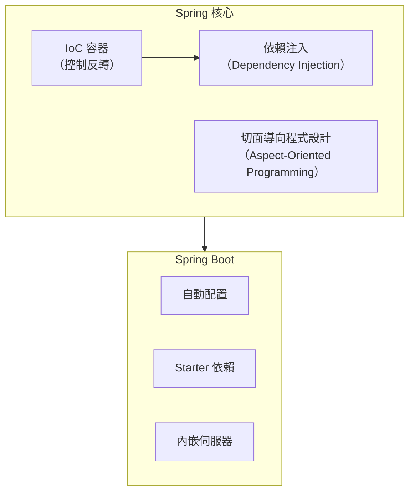

# Spring Boot Learning

Spring Boot 學習專案，採用 Gradle 多模組架構，從基礎概念到企業級安全實作，循序漸進學習 Spring 生態系。

---

## Spring Framework 簡介

### 發展歷程

```
2002 ─── Rod Johnson 出版《Expert One-on-One J2EE Design and Development》
         提出 J2EE 開發的簡化方案
         │
2004 ─── Spring Framework 1.0 發布
         核心：IoC 容器、AOP、簡化 JDBC
         │
2006 ─── Spring 2.0：XML 命名空間、AspectJ 整合
         │
2009 ─── Spring 3.0：Java 配置、REST 支援、SpEL
         │
2013 ─── Spring 4.0：Java 8 支援、WebSocket
         │
2014 ─── Spring Boot 1.0 發布 ⭐
         「約定優於配置」，大幅簡化 Spring 開發
         │
2017 ─── Spring 5.0：響應式編程（WebFlux）
         │
2022 ─── Spring Boot 3.0：Jakarta EE 9+、Java 17+、GraalVM 原生支援
```

### 為什麼選擇 Spring？

| 傳統 Java EE 問題 | Spring 的解決方案 |
|------------------|------------------|
| 大量 XML 配置 | 註解驅動 + 自動配置 |
| 程式碼與框架耦合 | IoC/DI 實現鬆耦合 |
| 測試困難 | 內建測試支援 |
| 部署複雜（需要應用伺服器） | 內嵌伺服器，獨立運行 |

### Spring 核心概念



---

## 專案結構

```
spring-boot-learning/
├── spring-boot-basics/           # 模組一：Spring Boot 基礎
│   ├── README.md                 # 教學文件（8 章節）
│   └── ANNOTATIONS.md            # 註解參考手冊
├── spring-security-demo/         # 模組二：Spring Security 安全
│   ├── README.md                 # 模組說明
│   └── SECURITY.md               # 教學文件（6 章節）
├── build.gradle                  # 根專案 Gradle 配置
├── settings.gradle               # 模組配置
└── README.md                     # 本文件
```

---

## 學習路線

建議依照以下順序學習：

```
┌─────────────────────────────────────────────────────────────────┐
│  1️⃣  Spring Boot 基礎 (spring-boot-basics/)                     │
│      ├── README.md      → 8 章節教學                            │
│      └── ANNOTATIONS.md → 註解參考手冊                           │
└─────────────────────────────────────────────────────────────────┘
                              ⬇️
┌─────────────────────────────────────────────────────────────────┐
│  2️⃣  Spring Security (spring-security-demo/)                    │
│      ├── README.md      → 模組使用說明                          │
│      └── SECURITY.md    → 6 章節教學                            │
└─────────────────────────────────────────────────────────────────┘
```

---

## 模組一：Spring Boot 基礎

📁 **目錄**：[spring-boot-basics](./spring-boot-basics/README.md)

透過電子商務 REST API 範例，學習 Spring Boot 核心功能。

### 教學大綱

| 章節 | 主題 | 說明 |
|------|------|------|
| 1 | Spring Boot 概述 | 為什麼使用 Spring Boot、核心特性 |
| 2 | IoC 與依賴注入 | Bean 容器、@Autowired、@Component |
| 3 | 分層架構 | Controller → Service → Repository |
| 4 | REST API 開發 | @RestController、HTTP 方法映射 |
| 5 | JPA 資料存取 | @Entity、Repository、JPQL |
| 6 | 請求驗證 | Bean Validation、@Valid |
| 7 | 異常處理 | @ControllerAdvice、全域異常 |
| 8 | 測試實作 | @SpringBootTest、MockMvc |

### 實作範例

- 商品 CRUD API (`/api/v1/products`)
- 訂單管理 API (`/api/v1/orders`)
- Swagger API 文件

**啟動**：`./gradlew :spring-boot-basics:bootRun`（Port 8080）

---

## 模組二：Spring Security

📁 **目錄**：[spring-security-demo](./spring-security-demo/README.md)

從資訊安全基礎到企業級認證授權實作。

### 教學大綱

| 章節 | 主題 | 說明 |
|------|------|------|
| 1 | 資訊安全基礎 | CIA 三角、常見威脅、加密概念 |
| 2 | 認證與授權機制 | OAuth2、JWT、OpenID Connect |
| 3 | Spring AOP 概念 | 切面、通知、切入點表達式 |
| 4 | Spring Security 實作 | Security Filter Chain、JWT 認證 |
| 5 | Keycloak 整合 | 企業級 IAM 解決方案 |
| 6 | 東西向/南北向安全 | API Gateway、Service Mesh、mTLS |

### 實作範例

- JWT Token 認證
- 角色基礎存取控制 (RBAC)
- 方法級安全 (`@PreAuthorize`)
- BCrypt 密碼加密

**啟動**：`./gradlew :spring-security-demo:bootRun`（Port 8081）

---

## 參考文件

各模組包含完整的教學與參考文件：

### Spring Boot 基礎模組

| 文件 | 說明 |
|------|------|
| [README.md](./spring-boot-basics/README.md) | 8 章節完整教學 |
| [ANNOTATIONS.md](./spring-boot-basics/ANNOTATIONS.md) | 10 大分類註解參考手冊 |

### Spring Security 模組

| 文件 | 說明 |
|------|------|
| [README.md](./spring-security-demo/README.md) | 模組使用說明、API 端點、測試帳號 |
| [SECURITY.md](./spring-security-demo/SECURITY.md) | 6 章節完整教學 |

---

## 環境需求

- **Java**: 17+
- **Gradle**: 8.5+
- **IDE**: IntelliJ IDEA / VS Code

---

## 快速開始

```bash
# 複製專案
git clone <repository-url>
cd spring-boot-learning

# 編譯所有模組
./gradlew build

# 執行測試
./gradlew test

# 啟動 Spring Boot 基礎模組
./gradlew :spring-boot-basics:bootRun

# 啟動 Spring Security 模組
./gradlew :spring-security-demo:bootRun
```

---

## 相關資源

- [Spring 官方網站](https://spring.io/)
- [Spring Boot 官方文檔](https://spring.io/projects/spring-boot)
- [Spring Security 參考指南](https://docs.spring.io/spring-security/reference/)
- [Baeldung Spring 教程](https://www.baeldung.com/spring-boot)
