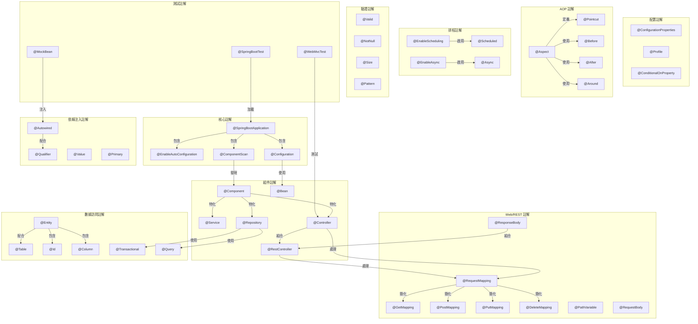
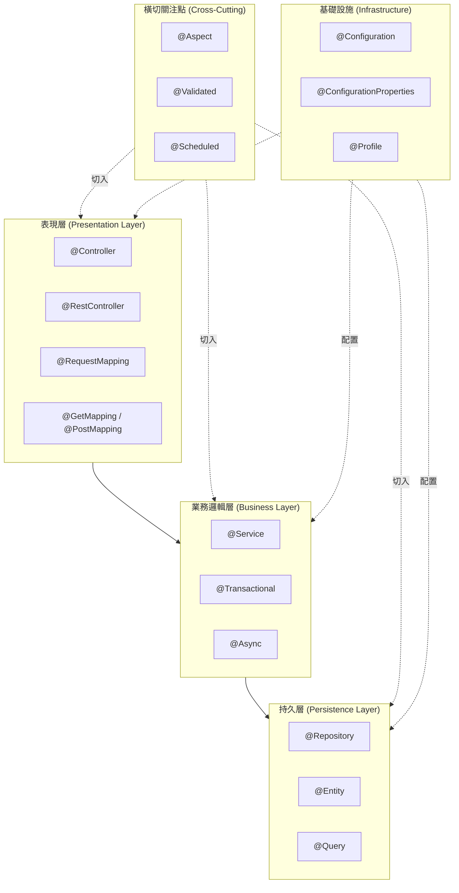
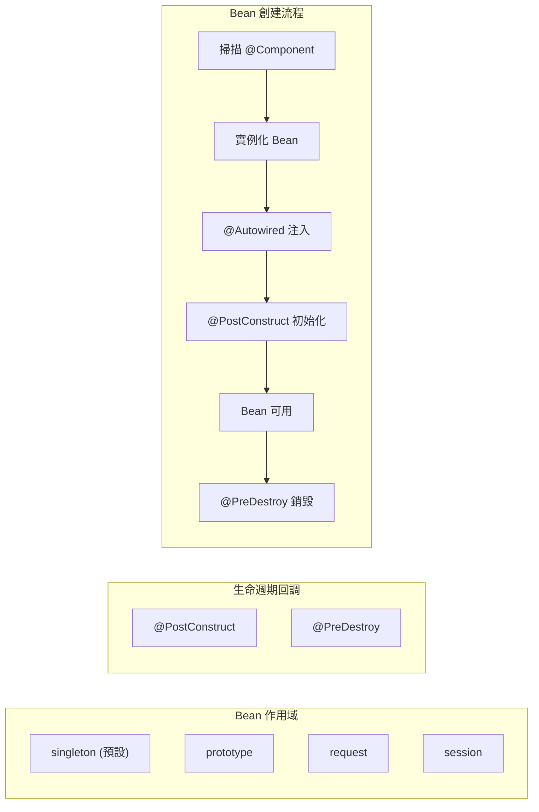

# Spring Boot Annotation 分類總覽

本文檔整理 Spring Boot 中常用的 Annotation（註解）分類及其功能說明。

---

## 目錄

1. [核心註解 (Core Annotations)](#1-核心註解-core-annotations)
2. [組件註解 (Component Annotations)](#2-組件註解-component-annotations)
3. [依賴注入註解 (Dependency Injection Annotations)](#3-依賴注入註解-dependency-injection-annotations)
4. [Web/REST 註解 (Web/REST Annotations)](#4-webrest-註解-webrest-annotations)
5. [數據訪問註解 (Data Access Annotations)](#5-數據訪問註解-data-access-annotations)
6. [配置相關註解 (Configuration Annotations)](#6-配置相關註解-configuration-annotations)
7. [AOP 註解 (Aspect-Oriented Programming Annotations)](#7-aop-註解-aspect-oriented-programming-annotations)
8. [排程註解 (Scheduling Annotations)](#8-排程註解-scheduling-annotations)
9. [驗證註解 (Validation Annotations)](#9-驗證註解-validation-annotations)
10. [測試註解 (Testing Annotations)](#10-測試註解-testing-annotations)

---

## 1. 核心註解 (Core Annotations)

用於啟動和配置 Spring Boot 應用程式的基礎註解。

| 註解 | 功能說明 |
|------|----------|
| `@SpringBootApplication` | 組合註解，包含 `@Configuration`、`@EnableAutoConfiguration`、`@ComponentScan`，是 Spring Boot 應用的入口點 |
| `@EnableAutoConfiguration` | 啟用 Spring Boot 的自動配置機制，根據 classpath 中的依賴自動配置 Bean |
| `@ComponentScan` | 指定 Spring 掃描組件的包路徑，自動發現和註冊 Bean |
| `@Configuration` | 標記類為配置類，可定義 Bean，等同於 XML 配置文件 |

---

## 2. 組件註解 (Component Annotations)

用於定義和標記不同類型的 Spring 管理組件。

| 註解 | 功能說明 |
|------|----------|
| `@Component` | 通用組件標記，將類標記為 Spring 管理的 Bean |
| `@Service` | 標記業務邏輯層組件，語義化的 `@Component` |
| `@Repository` | 標記數據訪問層組件，提供數據庫異常轉換功能 |
| `@Controller` | 標記 MVC 控制器，處理 HTTP 請求並返回視圖 |
| `@RestController` | 組合 `@Controller` 和 `@ResponseBody`，專用於 RESTful API |
| `@Bean` | 在 `@Configuration` 類中定義方法級別的 Bean |

---

## 3. 依賴注入註解 (Dependency Injection Annotations)

用於實現控制反轉（IoC）和依賴注入（DI）。

| 註解 | 功能說明 |
|------|----------|
| `@Autowired` | 自動裝配依賴，按類型注入 Bean |
| `@Qualifier` | 配合 `@Autowired` 使用，指定注入特定名稱的 Bean |
| `@Value` | 注入配置文件中的屬性值或 SpEL 表達式結果 |
| `@Resource` | JSR-250 標準註解，按名稱注入 Bean |
| `@Inject` | JSR-330 標準註解，功能類似 `@Autowired` |
| `@Primary` | 當有多個候選 Bean 時，標記優先注入的 Bean |
| `@Lazy` | 延遲初始化 Bean，在首次使用時才創建 |

---

## 4. Web/REST 註解 (Web/REST Annotations)

用於處理 HTTP 請求和構建 RESTful API。

| 註解 | 功能說明 |
|------|----------|
| `@RequestMapping` | 映射 HTTP 請求到處理方法，可指定路徑、方法、參數等 |
| `@GetMapping` | 處理 HTTP GET 請求，`@RequestMapping(method=GET)` 的簡寫 |
| `@PostMapping` | 處理 HTTP POST 請求 |
| `@PutMapping` | 處理 HTTP PUT 請求 |
| `@DeleteMapping` | 處理 HTTP DELETE 請求 |
| `@PatchMapping` | 處理 HTTP PATCH 請求 |
| `@PathVariable` | 從 URL 路徑中提取變數值 |
| `@RequestParam` | 獲取 URL 查詢參數或表單參數 |
| `@RequestBody` | 將 HTTP 請求體綁定到方法參數（通常用於 JSON） |
| `@ResponseBody` | 將方法返回值直接作為 HTTP 響應體 |
| `@ResponseStatus` | 指定方法返回的 HTTP 狀態碼 |
| `@RequestHeader` | 獲取 HTTP 請求頭的值 |
| `@CookieValue` | 獲取 Cookie 的值 |
| `@CrossOrigin` | 啟用跨域資源共享（CORS） |

---

## 5. 數據訪問註解 (Data Access Annotations)

用於 ORM 映射和數據庫操作。

| 註解 | 功能說明 |
|------|----------|
| `@Entity` | 標記類為 JPA 實體，對應數據庫表 |
| `@Table` | 指定實體對應的數據庫表名 |
| `@Id` | 標記實體的主鍵字段 |
| `@GeneratedValue` | 指定主鍵的生成策略 |
| `@Column` | 指定字段對應的數據庫列屬性 |
| `@Transactional` | 聲明方法或類使用事務管理 |
| `@Query` | 在 Repository 中定義自定義查詢語句 |
| `@Modifying` | 標記 `@Query` 為更新/刪除操作 |
| `@OneToMany` | 定義一對多關聯關係 |
| `@ManyToOne` | 定義多對一關聯關係 |
| `@ManyToMany` | 定義多對多關聯關係 |
| `@JoinColumn` | 指定外鍵列 |

---

## 6. 配置相關註解 (Configuration Annotations)

用於外部化配置和條件化 Bean 創建。

| 註解 | 功能說明 |
|------|----------|
| `@ConfigurationProperties` | 將配置文件屬性綁定到 Bean |
| `@EnableConfigurationProperties` | 啟用 `@ConfigurationProperties` 註解的類 |
| `@PropertySource` | 指定額外的屬性文件來源 |
| `@Profile` | 指定 Bean 在特定環境（dev/test/prod）下生效 |
| `@Conditional` | 根據條件決定是否創建 Bean |
| `@ConditionalOnProperty` | 根據配置屬性決定是否創建 Bean |
| `@ConditionalOnClass` | 當 classpath 存在指定類時創建 Bean |
| `@ConditionalOnMissingBean` | 當容器中不存在指定 Bean 時創建 |

---

## 7. AOP 註解 (Aspect-Oriented Programming Annotations)

用於實現面向切面編程，處理橫切關注點。

| 註解 | 功能說明 |
|------|----------|
| `@Aspect` | 標記類為切面類 |
| `@Pointcut` | 定義切入點表達式 |
| `@Before` | 在目標方法執行前執行通知 |
| `@After` | 在目標方法執行後執行通知（無論是否異常） |
| `@AfterReturning` | 在目標方法正常返回後執行通知 |
| `@AfterThrowing` | 在目標方法拋出異常後執行通知 |
| `@Around` | 環繞通知，完全控制目標方法的執行 |

---

## 8. 排程註解 (Scheduling Annotations)

用於定時任務和異步處理。

| 註解 | 功能說明 |
|------|----------|
| `@EnableScheduling` | 啟用定時任務功能 |
| `@Scheduled` | 標記方法為定時任務，支持 cron、fixedRate、fixedDelay |
| `@EnableAsync` | 啟用異步方法執行功能 |
| `@Async` | 標記方法為異步執行，在獨立線程中運行 |

---

## 9. 驗證註解 (Validation Annotations)

用於數據校驗（基於 JSR-303/JSR-380）。

| 註解 | 功能說明 |
|------|----------|
| `@Valid` | 觸發嵌套對象的驗證 |
| `@Validated` | Spring 的驗證註解，支持分組驗證 |
| `@NotNull` | 驗證值不為 null |
| `@NotEmpty` | 驗證字符串/集合不為空 |
| `@NotBlank` | 驗證字符串不為空且不只包含空白字符 |
| `@Size` | 驗證字符串/集合的長度範圍 |
| `@Min` / `@Max` | 驗證數值的最小/最大值 |
| `@Pattern` | 驗證字符串匹配正則表達式 |
| `@Email` | 驗證電子郵件格式 |

---

## 10. 測試註解 (Testing Annotations)

用於編寫單元測試和集成測試。

| 註解 | 功能說明 |
|------|----------|
| `@SpringBootTest` | 啟動完整的 Spring 應用上下文進行集成測試 |
| `@WebMvcTest` | 只加載 Web 層組件進行 MVC 測試 |
| `@DataJpaTest` | 只加載 JPA 相關組件進行數據層測試 |
| `@MockBean` | 在測試中創建 Mock 對象並注入到上下文 |
| `@SpyBean` | 創建 Spy 對象，可部分 Mock |
| `@TestConfiguration` | 定義測試專用的配置類 |
| `@BeforeEach` / `@AfterEach` | JUnit 5 的測試生命週期方法 |

---

## Annotation 關聯圖

---

## 層次架構圖

---

## 生命週期與作用域

---

## 參考資源

- [Spring Boot 官方文檔](https://spring.io/projects/spring-boot)
- [Spring Framework 參考指南](https://docs.spring.io/spring-framework/reference/)
- [Baeldung Spring 教程](https://www.baeldung.com/spring-boot)
