# Spring Security 完整教學指南

從資訊安全基礎觀念到企業級安全架構實作

---

## 目錄

1. [資訊安全基礎觀念](#第一章-資訊安全基礎觀念)
2. [認證與授權機制](#第二章-認證與授權機制-oauth2-jwt-openid-connect)
3. [Spring AOP 概念](#第三章-spring-aop-概念)
4. [Spring Security 基礎實作](#第四章-spring-security-基礎實作)
5. [Keycloak 整合實作](#第五章-keycloak-整合實作)
6. [東西向與南北向安全控管](#第六章-東西向與南北向安全控管)

---

# 第一章：資訊安全基礎觀念

> 本章節以淺顯易懂的方式介紹資訊安全的核心概念，適合初學者閱讀。

## 1.1 什麼是資訊安全？

想像你的家需要保護，你會怎麼做？

```
🏠 你的家                          💻 你的系統
├── 門鎖 → 只有有鑰匙的人能進入      ├── 登入系統 → 只有有帳號的人能使用
├── 門禁卡 → 記錄誰進出             ├── 日誌記錄 → 記錄誰做了什麼
├── 保全系統 → 防止小偷              ├── 防火牆 → 防止駭客入侵
└── 保險箱 → 保護重要物品            └── 加密 → 保護重要資料
```

**資訊安全的三大核心原則 (CIA Triad)：**

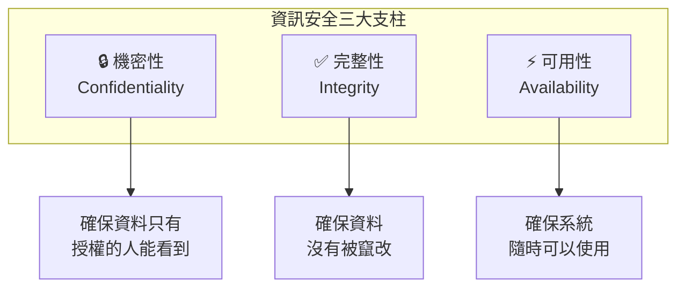

### 生活化範例

| 原則 | 日常生活例子 | 系統安全例子 |
|------|-------------|-------------|
| **機密性** | 你的日記只有你能看 | 你的密碼只有你知道 |
| **完整性** | 銀行帳戶餘額不會無故改變 | 訂單金額不會被竄改 |
| **可用性** | ATM 隨時可以領錢 | 網站 24 小時可以訪問 |

## 1.2 常見的安全威脅

### 🎭 身份冒充攻擊

```
正常情況：
用戶 Alice ──登入──> 系統：「我是 Alice，密碼是 abc123」
系統：「驗證成功，歡迎 Alice！」

攻擊情況：
駭客 Bob ──登入──> 系統：「我是 Alice，密碼是 abc123」（偷來的）
系統：「驗證成功，歡迎 Alice！」❌ 系統被騙了！
```

**防護方式：**
- 強密碼政策
- 多因素認證（MFA）
- 異常登入偵測

### 🕵️ 中間人攻擊 (Man-in-the-Middle)

```
正常情況：
你 ────────────────────────> 銀行網站
   「我要轉帳 1000 元給媽媽」

中間人攻擊：
你 ──> 駭客（偽裝成銀行）──> 銀行網站
   「轉帳 1000 元給媽媽」
        ↓
   駭客竄改成
   「轉帳 1000 元給駭客」❌
```

**防護方式：**
- HTTPS 加密連線
- 憑證驗證
- 資料簽章

### 💉 注入攻擊 (SQL Injection)

```sql
-- 正常的登入查詢
SELECT * FROM users WHERE username='alice' AND password='abc123'

-- 駭客輸入的惡意內容
用戶名：admin'--
密碼：隨便輸入

-- 變成了這樣的查詢
SELECT * FROM users WHERE username='admin'--' AND password='xxx'
-- 「--」後面的都被當成註解，密碼驗證被跳過了！❌
```

**防護方式：**
- 使用參數化查詢
- 輸入驗證
- 最小權限原則

## 1.3 認證 vs 授權

這是資訊安全中最重要的兩個概念：

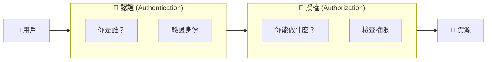

### 生活化比喻

| 概念 | 比喻 | 說明 |
|------|------|------|
| **認證** | 出示身分證 | 證明「我是誰」|
| **授權** | 檢查門票 | 確認「我能進去嗎」|

**範例情境：演唱會入場**

```
1. 認證：出示身分證，證明你是「王小明」
2. 授權：檢查門票，確認「王小明」買的是 VIP 票還是普通票
   - VIP 票 → 可以進入 VIP 區
   - 普通票 → 只能進入一般區
```

## 1.4 加密基礎概念

### 對稱加密 vs 非對稱加密

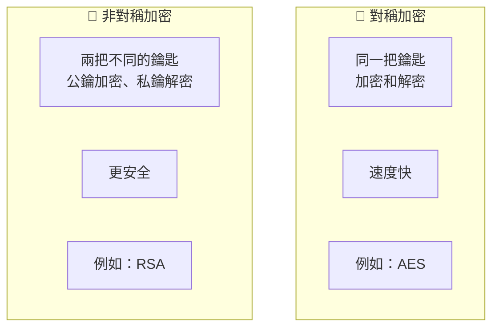

### 對稱加密 - 共用鑰匙

```
Alice 和 Bob 共用一把鑰匙 🔑

Alice: "Hello" ──[🔑加密]──> "X#@!$" ──傳送──> Bob
Bob:   "X#@!$" ──[🔑解密]──> "Hello"

問題：如何安全地把鑰匙給對方？🤔
```

### 非對稱加密 - 公私鑰配對

```
Bob 有一對鑰匙：
- 🔓 公鑰（公開給所有人）
- 🔐 私鑰（只有 Bob 知道）

Alice: "Hello" ──[Bob的🔓公鑰加密]──> "X#@!$" ──傳送──> Bob
Bob:   "X#@!$" ──[Bob的🔐私鑰解密]──> "Hello"

優點：即使公鑰被攔截，沒有私鑰也無法解密！✅
```

### 雜湊函數 (Hash)

```
密碼: "password123"
         ↓ SHA-256 雜湊
雜湊值: "ef92b778bafe77...（64位）"

特點：
✅ 單向：無法從雜湊值還原密碼
✅ 固定長度：不論輸入多長，輸出固定長度
✅ 雪崩效應：輸入改變一點，輸出完全不同

"password123" → "ef92b778bafe77..."
"password124" → "5c29a51e9f3c2d..."（完全不同！）
```

## 1.5 安全設計原則

### 最小權限原則 (Least Privilege)

```
❌ 錯誤做法：給所有員工管理員權限
   └── 風險：任何人都能刪除重要資料

✅ 正確做法：只給需要的權限
   ├── 一般員工：只能查看自己的資料
   ├── 主管：可以查看部門資料
   └── 管理員：可以管理所有資料
```

### 深度防禦 (Defense in Depth)

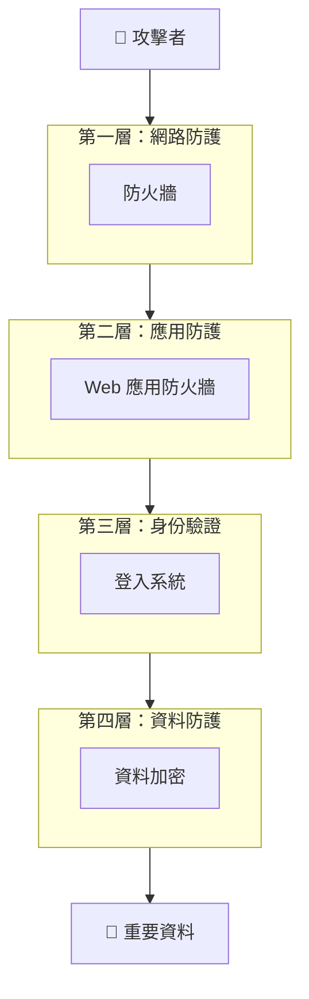

就像城堡有多道城牆，即使攻破一道，還有其他防線！

### 預設拒絕 (Default Deny)

```
❌ 預設允許：
   if (user.hasPermission("delete")) {
       deny();  // 只擋住有 delete 權限的
   }
   allow();  // 其他都允許 → 危險！

✅ 預設拒絕：
   if (user.hasPermission("read")) {
       allow();  // 明確允許有 read 權限的
   }
   deny();  // 其他都拒絕 → 安全！
```

---

# 第二章：認證與授權機制 (OAuth2, JWT, OpenID Connect)

## 2.1 傳統認證方式的問題

### Session-Cookie 認證

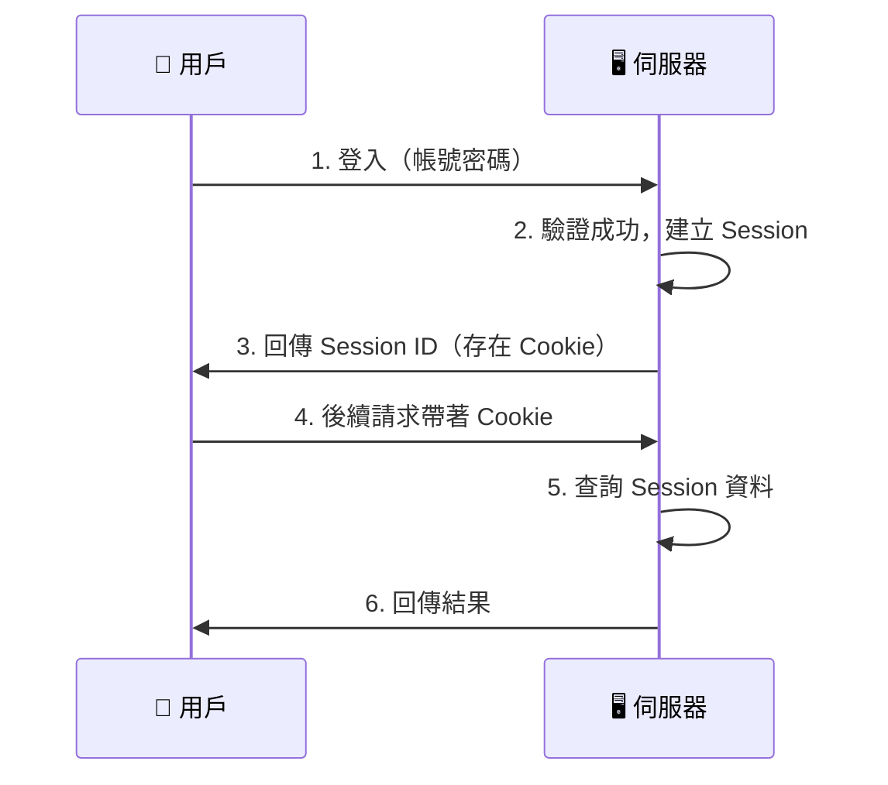

**問題：**
- 伺服器需要儲存 Session（記憶體負擔）
- 多台伺服器需要共享 Session（擴展困難）
- 跨網域困難

## 2.2 JWT (JSON Web Token)

### JWT 是什麼？

JWT 就像一張「自帶驗證功能的身分證」：

```
┌─────────────────────────────────────────────────────────┐
│                    JWT 結構                              │
├─────────────────────────────────────────────────────────┤
│ Header.Payload.Signature                                │
│                                                         │
│ eyJhbGciOiJIUzI1NiJ9.                    ← 標頭（紅色） │
│ eyJzdWIiOiJ1c2VyMTIzIiwiZXhwIjoxNjE2...  ← 載荷（紫色） │
│ SflKxwRJSMeKKF2QT4fwpMeJf36POk6yJV...    ← 簽章（藍色） │
└─────────────────────────────────────────────────────────┘
```

### JWT 的三個部分

```json
// 1. Header（標頭）- 說明使用的演算法
{
  "alg": "HS256",    // 簽章演算法
  "typ": "JWT"       // 類型
}

// 2. Payload（載荷）- 存放資料
{
  "sub": "user123",           // 用戶 ID
  "name": "王小明",            // 用戶名稱
  "role": "admin",            // 角色
  "iat": 1516239022,          // 發行時間
  "exp": 1516242622           // 過期時間
}

// 3. Signature（簽章）- 防止竄改
HMACSHA256(
  base64UrlEncode(header) + "." + base64UrlEncode(payload),
  secret_key
)
```

### JWT 運作流程

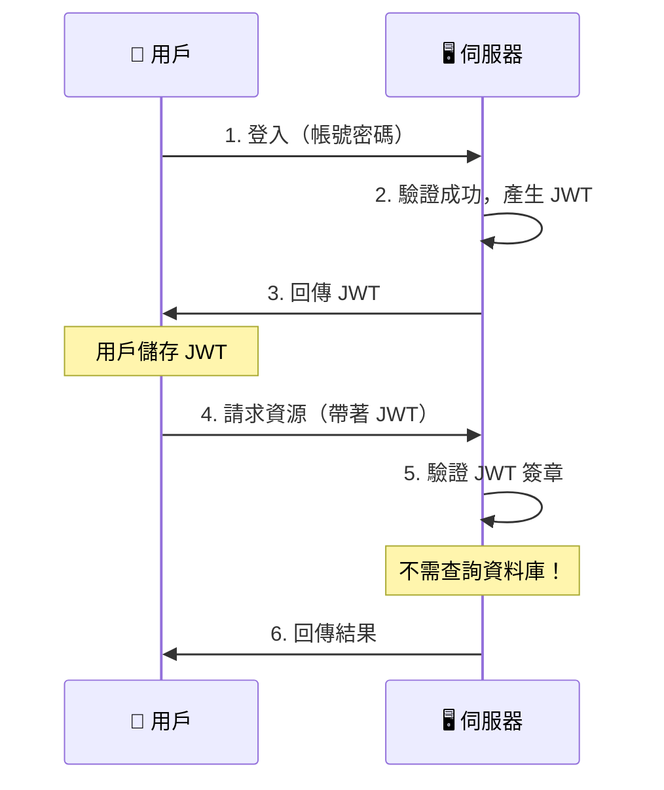

### JWT 的優點

| 特點 | 說明 |
|------|------|
| **無狀態** | 伺服器不需儲存 Session |
| **可擴展** | 多台伺服器不需共享狀態 |
| **跨網域** | 可以輕鬆在不同網域間傳遞 |
| **自包含** | Token 本身包含所有需要的資訊 |

## 2.3 OAuth 2.0

### 什麼是 OAuth 2.0？

OAuth 2.0 是一個**授權框架**，讓第三方應用可以安全地存取用戶資源。

**生活化比喻：**
```
情境：你想讓「印照片 App」存取你的 Google 相簿

❌ 不安全的做法：
   把 Google 帳號密碼給「印照片 App」
   → 風險：它可以看你的 Email、刪除你的檔案...

✅ OAuth 2.0 的做法：
   1. 「印照片 App」把你導向 Google
   2. 你在 Google 登入並同意「只允許讀取相簿」
   3. Google 給「印照片 App」一個限定權限的令牌
   → 安全：它只能讀取相簿，無法做其他事！
```

### OAuth 2.0 四種角色

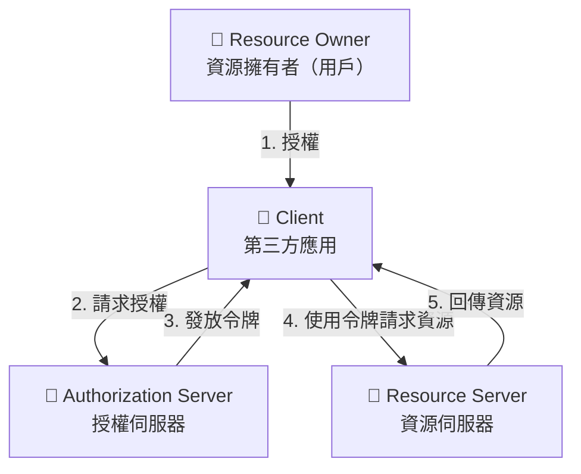

### 授權碼模式 (Authorization Code Flow)

這是最安全、最常用的模式：

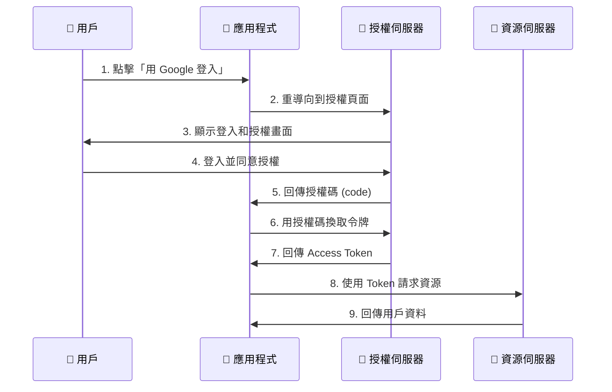

### OAuth 2.0 的令牌類型

| 令牌類型 | 用途 | 有效期 |
|----------|------|--------|
| **Access Token** | 存取資源 | 短（分鐘~小時）|
| **Refresh Token** | 更新 Access Token | 長（天~月）|
| **ID Token** | 身份資訊（OpenID Connect）| 短 |

## 2.4 OpenID Connect (OIDC)

### OAuth 2.0 vs OpenID Connect

```
OAuth 2.0 = 授權（Authorization）
  → 回答：「這個應用可以存取哪些資源？」

OpenID Connect = OAuth 2.0 + 認證（Authentication）
  → 額外回答：「這個用戶是誰？」
```

### ID Token

OpenID Connect 在 OAuth 2.0 基礎上，增加了 **ID Token**：

```json
// ID Token 的 Payload
{
  "iss": "https://accounts.google.com",  // 發行者
  "sub": "1234567890",                    // 用戶唯一識別碼
  "aud": "my-app-client-id",              // 接收者（你的應用）
  "exp": 1616239022,                      // 過期時間
  "iat": 1616235422,                      // 發行時間
  "name": "王小明",                        // 用戶名稱
  "email": "xiaoming@gmail.com",          // Email
  "picture": "https://..."                // 頭像
}
```

### OIDC 流程

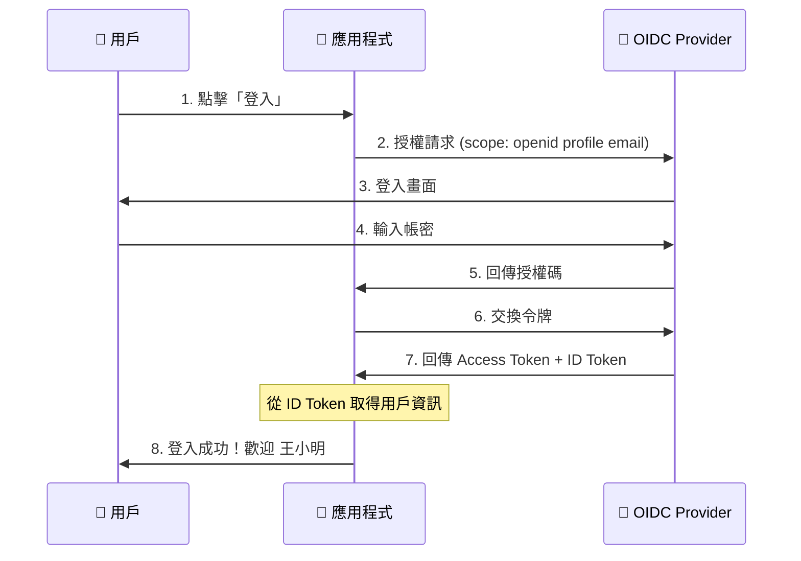

## 2.5 Token 安全最佳實踐

### 儲存位置

| 儲存位置 | 安全性 | 適用場景 |
|----------|--------|----------|
| **HttpOnly Cookie** | ⭐⭐⭐ | Web 應用（防 XSS）|
| **記憶體變數** | ⭐⭐⭐ | SPA（最安全但重整會遺失）|
| **LocalStorage** | ⭐ | 不建議（易受 XSS 攻擊）|

### 安全建議

```java
// ✅ 好的做法
@Configuration
public class SecurityConfig {

    // 1. Access Token 設短期效期
    private static final long ACCESS_TOKEN_VALIDITY = 15 * 60; // 15 分鐘

    // 2. 使用 HttpOnly Cookie
    @Bean
    public CookieSerializer cookieSerializer() {
        DefaultCookieSerializer serializer = new DefaultCookieSerializer();
        serializer.setHttpOnly(true);      // 防止 JavaScript 存取
        serializer.setSecure(true);        // 只在 HTTPS 傳輸
        serializer.setSameSite("Strict");  // 防止 CSRF
        return serializer;
    }
}
```

---

# 第三章：Spring AOP 概念

> 理解 AOP 是理解 Spring Security 運作原理的關鍵！

## 3.1 什麼是 AOP？

**AOP (Aspect-Oriented Programming)** = 切面導向程式設計

### 問題情境

假設你需要在每個方法加上日誌記錄：

```java
// ❌ 傳統做法：到處複製貼上
public class OrderService {
    public void createOrder(Order order) {
        log.info("開始執行 createOrder");  // 重複程式碼
        // 業務邏輯...
        log.info("結束執行 createOrder");  // 重複程式碼
    }

    public void cancelOrder(Long orderId) {
        log.info("開始執行 cancelOrder");  // 重複程式碼
        // 業務邏輯...
        log.info("結束執行 cancelOrder");  // 重複程式碼
    }
}
```

### AOP 的解決方案

```java
// ✅ AOP 做法：集中管理橫切關注點
@Aspect
@Component
public class LoggingAspect {

    @Around("execution(* com.example.service.*.*(..))")
    public Object logMethod(ProceedingJoinPoint joinPoint) throws Throwable {
        String methodName = joinPoint.getSignature().getName();
        log.info("開始執行 {}", methodName);

        Object result = joinPoint.proceed();  // 執行原方法

        log.info("結束執行 {}", methodName);
        return result;
    }
}

// 業務程式碼保持乾淨
public class OrderService {
    public void createOrder(Order order) {
        // 只寫業務邏輯，日誌自動加上！
    }
}
```

## 3.2 AOP 核心概念

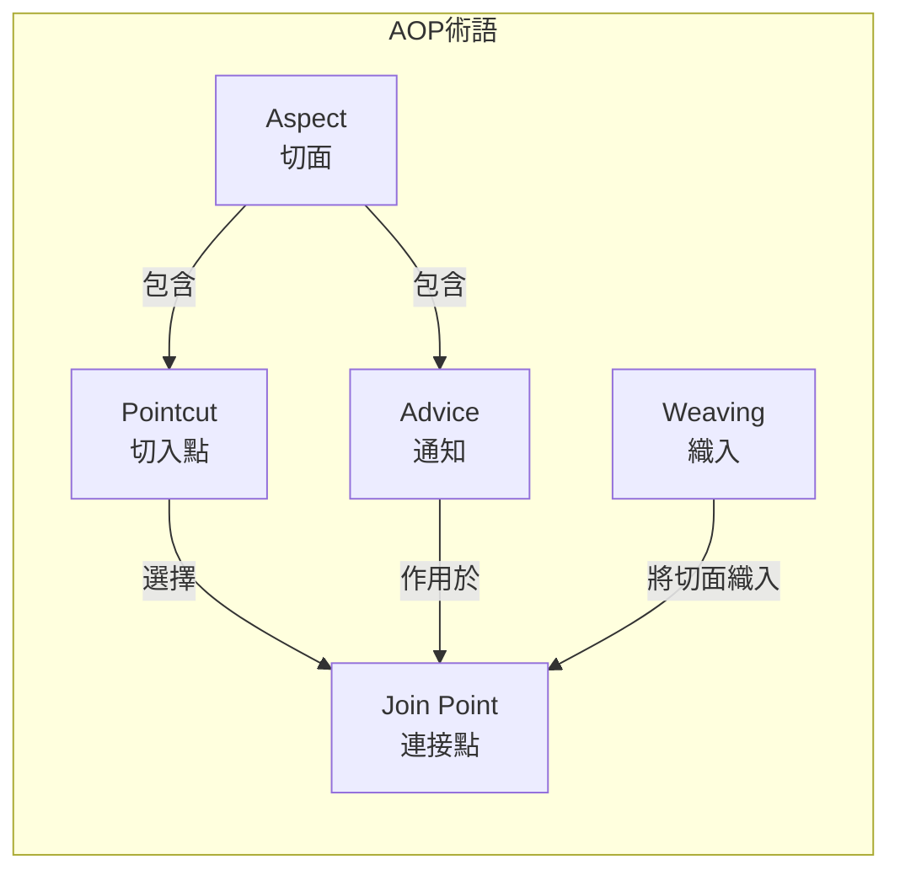

### 術語對照表

| 術語 | 比喻 | 說明 |
|------|------|------|
| **Aspect（切面）** | 一套完整的安檢流程 | 定義「做什麼」和「在哪做」|
| **Join Point（連接點）** | 可以進行安檢的地點 | 程式執行的某個點（方法執行、例外拋出等）|
| **Pointcut（切入點）** | 決定在哪些地點安檢 | 用表達式選擇哪些 Join Point |
| **Advice（通知）** | 實際的安檢動作 | 在 Join Point 執行的程式碼 |
| **Weaving（織入）** | 把安檢流程部署到各地點 | 將切面套用到目標物件 |

## 3.3 Advice 類型

```java
@Aspect
@Component
public class SecurityAspect {

    // 1. @Before - 方法執行「前」
    @Before("execution(* com.example.service.*.*(..))")
    public void checkPermission(JoinPoint joinPoint) {
        log.info("檢查權限...");
    }

    // 2. @After - 方法執行「後」（不論成功或失敗）
    @After("execution(* com.example.service.*.*(..))")
    public void cleanup(JoinPoint joinPoint) {
        log.info("清理資源...");
    }

    // 3. @AfterReturning - 方法「成功返回後」
    @AfterReturning(pointcut = "execution(* com.example.service.*.*(..))",
                    returning = "result")
    public void logSuccess(JoinPoint joinPoint, Object result) {
        log.info("方法成功執行，結果: {}", result);
    }

    // 4. @AfterThrowing - 方法「拋出例外後」
    @AfterThrowing(pointcut = "execution(* com.example.service.*.*(..))",
                   throwing = "error")
    public void logError(JoinPoint joinPoint, Throwable error) {
        log.error("方法執行失敗: {}", error.getMessage());
    }

    // 5. @Around - 「環繞」方法執行（最強大）
    @Around("execution(* com.example.service.*.*(..))")
    public Object measureTime(ProceedingJoinPoint joinPoint) throws Throwable {
        long start = System.currentTimeMillis();

        Object result = joinPoint.proceed();  // 執行原方法

        long duration = System.currentTimeMillis() - start;
        log.info("執行耗時: {}ms", duration);

        return result;
    }
}
```

### Advice 執行順序

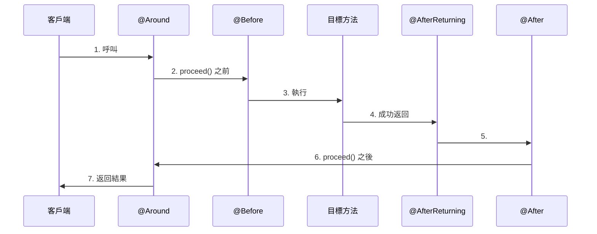

## 3.4 Pointcut 表達式

### 常用表達式

```java
// 1. execution - 匹配方法執行
@Pointcut("execution(* com.example.service.*.*(..))")
//          │       │ │        │ │ └─ 任意參數
//          │       │ │        │ └─── 任意方法名
//          │       │ │        └───── 任意類別
//          │       │ └────────────── 包路徑
//          │       └──────────────── 任意返回類型
//          └──────────────────────── 表達式類型

// 2. within - 匹配特定類型
@Pointcut("within(com.example.service.*)")

// 3. @annotation - 匹配帶有特定註解的方法
@Pointcut("@annotation(org.springframework.transaction.annotation.Transactional)")

// 4. @within - 匹配帶有特定註解的類別
@Pointcut("@within(org.springframework.stereotype.Service)")

// 5. 組合使用
@Pointcut("execution(* com.example.service.*.*(..)) && @annotation(Secured)")
```

## 3.5 AOP 在 Spring Security 的應用

Spring Security 大量使用 AOP 來實現安全檢查：

```java
// Spring Security 內部使用 AOP 來攔截方法
// 當你使用 @PreAuthorize 時，實際上是這樣運作的：

@Service
public class OrderService {

    @PreAuthorize("hasRole('ADMIN')")
    public void deleteOrder(Long orderId) {
        // 只有 ADMIN 可以執行
    }
}

// Spring Security 的 AOP 會在方法執行前檢查權限：
// if (!hasRole("ADMIN")) {
//     throw new AccessDeniedException("權限不足");
// }
```

---

# 第四章：Spring Security 基礎實作

## 4.1 加入 Spring Security

### Maven 依賴

```xml
<dependencies>
    <!-- Spring Security -->
    <dependency>
        <groupId>org.springframework.boot</groupId>
        <artifactId>spring-boot-starter-security</artifactId>
    </dependency>

    <!-- JWT 支援 -->
    <dependency>
        <groupId>io.jsonwebtoken</groupId>
        <artifactId>jjwt-api</artifactId>
        <version>0.11.5</version>
    </dependency>
    <dependency>
        <groupId>io.jsonwebtoken</groupId>
        <artifactId>jjwt-impl</artifactId>
        <version>0.11.5</version>
        <scope>runtime</scope>
    </dependency>
    <dependency>
        <groupId>io.jsonwebtoken</groupId>
        <artifactId>jjwt-jackson</artifactId>
        <version>0.11.5</version>
        <scope>runtime</scope>
    </dependency>
</dependencies>
```

### 預設行為

加入 Spring Security 後，**所有端點都需要認證**：

```bash
# 訪問任何 API 都會被重導向到登入頁面
curl http://localhost:8080/api/products
# 回應：302 Redirect to /login
```

## 4.2 Security Filter Chain

Spring Security 使用過濾器鏈（Filter Chain）來處理請求：

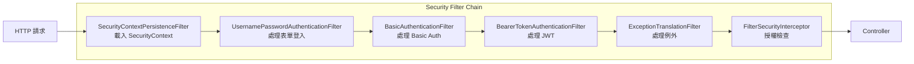

## 4.3 基本配置

### SecurityConfig.java

```java
package com.ecommerce.config;

import org.springframework.context.annotation.Bean;
import org.springframework.context.annotation.Configuration;
import org.springframework.security.config.annotation.method.configuration.EnableMethodSecurity;
import org.springframework.security.config.annotation.web.builders.HttpSecurity;
import org.springframework.security.config.annotation.web.configuration.EnableWebSecurity;
import org.springframework.security.config.http.SessionCreationPolicy;
import org.springframework.security.crypto.bcrypt.BCryptPasswordEncoder;
import org.springframework.security.crypto.password.PasswordEncoder;
import org.springframework.security.web.SecurityFilterChain;

/**
 * Spring Security 配置類
 *
 * @Configuration: 標記為配置類
 * @EnableWebSecurity: 啟用 Web 安全功能
 * @EnableMethodSecurity: 啟用方法級別安全（@PreAuthorize 等）
 */
@Configuration
@EnableWebSecurity
@EnableMethodSecurity
public class SecurityConfig {

    /**
     * 配置 Security Filter Chain
     */
    @Bean
    public SecurityFilterChain securityFilterChain(HttpSecurity http) throws Exception {
        http
            // 1. 停用 CSRF（因為使用 JWT，不需要 CSRF 保護）
            .csrf(csrf -> csrf.disable())

            // 2. 設定 Session 管理（無狀態）
            .sessionManagement(session ->
                session.sessionCreationPolicy(SessionCreationPolicy.STATELESS))

            // 3. 配置路徑授權規則
            .authorizeHttpRequests(auth -> auth
                // 公開路徑
                .requestMatchers(
                    "/api/auth/**",           // 認證相關
                    "/swagger-ui/**",         // Swagger UI
                    "/api-docs/**",           // API 文件
                    "/h2-console/**"          // H2 Console
                ).permitAll()

                // 需要特定角色
                .requestMatchers("/api/admin/**").hasRole("ADMIN")

                // 其他路徑需要認證
                .anyRequest().authenticated()
            )

            // 4. 允許 H2 Console 使用 iframe
            .headers(headers -> headers.frameOptions(frame -> frame.disable()));

        return http.build();
    }

    /**
     * 密碼編碼器
     * 使用 BCrypt 演算法加密密碼
     */
    @Bean
    public PasswordEncoder passwordEncoder() {
        return new BCryptPasswordEncoder();
    }
}
```

## 4.4 用戶認證實作

### User 實體

```java
@Entity
@Table(name = "users")
@Getter
@Setter
@NoArgsConstructor
@AllArgsConstructor
@Builder
public class User implements UserDetails {

    @Id
    @GeneratedValue(strategy = GenerationType.IDENTITY)
    private Long id;

    @Column(unique = true, nullable = false)
    private String username;

    @Column(nullable = false)
    private String password;

    @Column(unique = true, nullable = false)
    private String email;

    @Column(nullable = false)
    private boolean enabled = true;

    @ElementCollection(fetch = FetchType.EAGER)
    @CollectionTable(name = "user_roles", joinColumns = @JoinColumn(name = "user_id"))
    @Column(name = "role")
    private Set<String> roles = new HashSet<>();

    // ========== UserDetails 介面實作 ==========

    @Override
    public Collection<? extends GrantedAuthority> getAuthorities() {
        return roles.stream()
            .map(role -> new SimpleGrantedAuthority("ROLE_" + role))
            .collect(Collectors.toSet());
    }

    @Override
    public boolean isAccountNonExpired() {
        return true;
    }

    @Override
    public boolean isAccountNonLocked() {
        return true;
    }

    @Override
    public boolean isCredentialsNonExpired() {
        return true;
    }
}
```

### UserDetailsService 實作

```java
@Service
@RequiredArgsConstructor
public class CustomUserDetailsService implements UserDetailsService {

    private final UserRepository userRepository;

    /**
     * Spring Security 呼叫此方法載入用戶資訊
     */
    @Override
    public UserDetails loadUserByUsername(String username) throws UsernameNotFoundException {
        return userRepository.findByUsername(username)
            .orElseThrow(() -> new UsernameNotFoundException("用戶不存在: " + username));
    }
}
```

## 4.5 JWT 實作

### JwtService.java

```java
@Service
public class JwtService {

    @Value("${jwt.secret}")
    private String secretKey;

    @Value("${jwt.expiration}")
    private long jwtExpiration;

    /**
     * 從 Token 中提取用戶名
     */
    public String extractUsername(String token) {
        return extractClaim(token, Claims::getSubject);
    }

    /**
     * 產生 JWT Token
     */
    public String generateToken(UserDetails userDetails) {
        Map<String, Object> claims = new HashMap<>();

        // 加入用戶角色
        claims.put("roles", userDetails.getAuthorities().stream()
            .map(GrantedAuthority::getAuthority)
            .collect(Collectors.toList()));

        return buildToken(claims, userDetails, jwtExpiration);
    }

    /**
     * 驗證 Token 是否有效
     */
    public boolean isTokenValid(String token, UserDetails userDetails) {
        final String username = extractUsername(token);
        return username.equals(userDetails.getUsername()) && !isTokenExpired(token);
    }

    private String buildToken(Map<String, Object> claims, UserDetails userDetails, long expiration) {
        return Jwts.builder()
            .setClaims(claims)
            .setSubject(userDetails.getUsername())
            .setIssuedAt(new Date())
            .setExpiration(new Date(System.currentTimeMillis() + expiration))
            .signWith(getSigningKey(), SignatureAlgorithm.HS256)
            .compact();
    }

    private boolean isTokenExpired(String token) {
        return extractExpiration(token).before(new Date());
    }

    private Date extractExpiration(String token) {
        return extractClaim(token, Claims::getExpiration);
    }

    private <T> T extractClaim(String token, Function<Claims, T> claimsResolver) {
        final Claims claims = extractAllClaims(token);
        return claimsResolver.apply(claims);
    }

    private Claims extractAllClaims(String token) {
        return Jwts.parserBuilder()
            .setSigningKey(getSigningKey())
            .build()
            .parseClaimsJws(token)
            .getBody();
    }

    private Key getSigningKey() {
        byte[] keyBytes = Decoders.BASE64.decode(secretKey);
        return Keys.hmacShaKeyFor(keyBytes);
    }
}
```

### JwtAuthenticationFilter.java

```java
@Component
@RequiredArgsConstructor
public class JwtAuthenticationFilter extends OncePerRequestFilter {

    private final JwtService jwtService;
    private final UserDetailsService userDetailsService;

    @Override
    protected void doFilterInternal(
            HttpServletRequest request,
            HttpServletResponse response,
            FilterChain filterChain) throws ServletException, IOException {

        // 1. 從請求標頭取得 Token
        final String authHeader = request.getHeader("Authorization");

        if (authHeader == null || !authHeader.startsWith("Bearer ")) {
            filterChain.doFilter(request, response);
            return;
        }

        final String jwt = authHeader.substring(7);  // 移除 "Bearer " 前綴
        final String username = jwtService.extractUsername(jwt);

        // 2. 驗證 Token 並設定 SecurityContext
        if (username != null && SecurityContextHolder.getContext().getAuthentication() == null) {
            UserDetails userDetails = userDetailsService.loadUserByUsername(username);

            if (jwtService.isTokenValid(jwt, userDetails)) {
                UsernamePasswordAuthenticationToken authToken =
                    new UsernamePasswordAuthenticationToken(
                        userDetails,
                        null,
                        userDetails.getAuthorities()
                    );
                authToken.setDetails(new WebAuthenticationDetailsSource().buildDetails(request));

                SecurityContextHolder.getContext().setAuthentication(authToken);
            }
        }

        filterChain.doFilter(request, response);
    }
}
```

## 4.6 認證 API

### AuthController.java

```java
@RestController
@RequestMapping("/api/auth")
@RequiredArgsConstructor
@Tag(name = "認證", description = "用戶認證相關 API")
public class AuthController {

    private final AuthenticationManager authenticationManager;
    private final UserService userService;
    private final JwtService jwtService;

    /**
     * 用戶註冊
     */
    @PostMapping("/register")
    @Operation(summary = "用戶註冊")
    public ResponseEntity<AuthResponse> register(@Valid @RequestBody RegisterRequest request) {
        User user = userService.register(request);
        String token = jwtService.generateToken(user);

        return ResponseEntity.ok(new AuthResponse(token, "Bearer", user.getUsername()));
    }

    /**
     * 用戶登入
     */
    @PostMapping("/login")
    @Operation(summary = "用戶登入")
    public ResponseEntity<AuthResponse> login(@Valid @RequestBody LoginRequest request) {
        // 1. 驗證帳號密碼
        authenticationManager.authenticate(
            new UsernamePasswordAuthenticationToken(
                request.getUsername(),
                request.getPassword()
            )
        );

        // 2. 載入用戶資訊
        User user = userService.findByUsername(request.getUsername());

        // 3. 產生 JWT
        String token = jwtService.generateToken(user);

        return ResponseEntity.ok(new AuthResponse(token, "Bearer", user.getUsername()));
    }
}

// DTO 類別
@Data
public class LoginRequest {
    @NotBlank(message = "用戶名不能為空")
    private String username;

    @NotBlank(message = "密碼不能為空")
    private String password;
}

@Data
@AllArgsConstructor
public class AuthResponse {
    private String token;
    private String tokenType;
    private String username;
}
```

## 4.7 方法級別安全

```java
@Service
@RequiredArgsConstructor
public class ProductService {

    /**
     * @PreAuthorize: 方法執行「前」檢查權限
     */
    @PreAuthorize("hasRole('ADMIN')")
    public void deleteProduct(Long id) {
        // 只有 ADMIN 可以執行
    }

    /**
     * @PostAuthorize: 方法執行「後」檢查權限
     */
    @PostAuthorize("returnObject.owner == authentication.name")
    public Product getProduct(Long id) {
        // 只能查看自己的商品
        return productRepository.findById(id).orElseThrow();
    }

    /**
     * @PreFilter: 過濾輸入集合
     */
    @PreFilter("filterObject.owner == authentication.name")
    public void updateProducts(List<Product> products) {
        // 只更新自己的商品
    }

    /**
     * @PostFilter: 過濾輸出集合
     */
    @PostFilter("filterObject.active == true")
    public List<Product> getAllProducts() {
        // 只返回上架的商品
        return productRepository.findAll();
    }

    /**
     * 使用 SpEL 表達式
     */
    @PreAuthorize("hasRole('ADMIN') or #id == authentication.principal.id")
    public void updateUser(Long id, UserUpdateRequest request) {
        // ADMIN 可以更新任何用戶，普通用戶只能更新自己
    }
}
```

---

# 第五章：Keycloak 整合實作

## 5.1 什麼是 Keycloak？

**Keycloak** 是一個開源的身份識別和存取管理（IAM）解決方案。

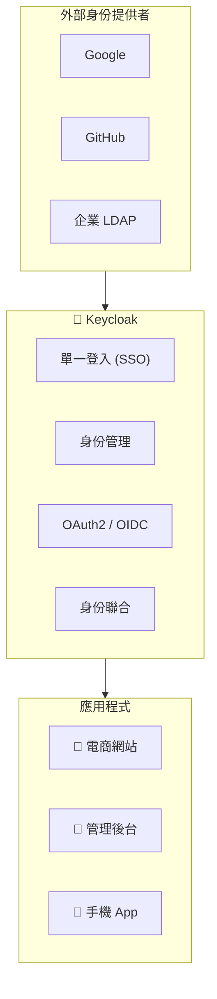

### 為什麼使用 Keycloak？

| 功能 | 自己開發 | 使用 Keycloak |
|------|---------|--------------|
| 用戶管理 | 需自行開發 | ✅ 內建管理介面 |
| 單一登入 | 複雜 | ✅ 開箱即用 |
| 多因素認證 | 需整合 | ✅ 內建支援 |
| 社群登入 | 逐一整合 | ✅ 預設支援多種 |
| 權限管理 | 需設計 | ✅ 角色、群組、權限 |

## 5.2 Keycloak 安裝

### Docker Compose

```yaml
# docker-compose.yml
version: '3.8'
services:
  keycloak:
    image: quay.io/keycloak/keycloak:23.0
    command: start-dev
    environment:
      KEYCLOAK_ADMIN: admin
      KEYCLOAK_ADMIN_PASSWORD: admin
    ports:
      - "8180:8080"
    volumes:
      - keycloak_data:/opt/keycloak/data

volumes:
  keycloak_data:
```

```bash
# 啟動 Keycloak
docker-compose up -d

# 訪問管理介面
# http://localhost:8180
# 帳號：admin
# 密碼：admin
```

## 5.3 Keycloak 配置

### 建立 Realm

```
Realm = 獨立的安全域，隔離不同應用的用戶和配置

1. 登入 Keycloak 管理介面
2. 點擊左上角 "master" 下拉選單
3. 選擇 "Create Realm"
4. 輸入 Realm name: "ecommerce"
5. 點擊 "Create"
```

### 建立 Client

```
Client = 需要 Keycloak 認證的應用程式

1. 選擇 "ecommerce" Realm
2. 點擊 "Clients" → "Create client"
3. 設定：
   - Client type: OpenID Connect
   - Client ID: ecommerce-api
   - Client authentication: ON（機密型客戶端）
4. 設定 Redirect URIs: http://localhost:8080/*
5. 設定 Web Origins: http://localhost:8080
```

### 建立角色和用戶

```
建立角色：
1. Realm roles → Create role
2. 建立：ADMIN, USER, MANAGER

建立用戶：
1. Users → Create user
2. 填寫用戶資訊
3. Credentials → Set password
4. Role mapping → 分配角色
```

## 5.4 Spring Boot 整合 Keycloak

### Maven 依賴

```xml
<dependency>
    <groupId>org.springframework.boot</groupId>
    <artifactId>spring-boot-starter-oauth2-resource-server</artifactId>
</dependency>
```

### application.yml

```yaml
spring:
  security:
    oauth2:
      resourceserver:
        jwt:
          issuer-uri: http://localhost:8180/realms/ecommerce
          jwk-set-uri: http://localhost:8180/realms/ecommerce/protocol/openid-connect/certs

# Keycloak 相關設定
keycloak:
  realm: ecommerce
  auth-server-url: http://localhost:8180
  resource: ecommerce-api
```

### SecurityConfig for Keycloak

```java
@Configuration
@EnableWebSecurity
@EnableMethodSecurity
public class SecurityConfig {

    @Bean
    public SecurityFilterChain securityFilterChain(HttpSecurity http) throws Exception {
        http
            .csrf(csrf -> csrf.disable())
            .authorizeHttpRequests(auth -> auth
                .requestMatchers("/api/public/**").permitAll()
                .requestMatchers("/api/admin/**").hasRole("ADMIN")
                .anyRequest().authenticated()
            )
            // 配置為 OAuth2 Resource Server
            .oauth2ResourceServer(oauth2 -> oauth2
                .jwt(jwt -> jwt.jwtAuthenticationConverter(jwtAuthenticationConverter()))
            );

        return http.build();
    }

    /**
     * 自訂 JWT 轉換器，將 Keycloak 角色映射到 Spring Security
     */
    @Bean
    public JwtAuthenticationConverter jwtAuthenticationConverter() {
        JwtGrantedAuthoritiesConverter grantedAuthoritiesConverter =
            new JwtGrantedAuthoritiesConverter();

        // Keycloak 的角色在 realm_access.roles 中
        grantedAuthoritiesConverter.setAuthoritiesClaimName("realm_access.roles");
        grantedAuthoritiesConverter.setAuthorityPrefix("ROLE_");

        JwtAuthenticationConverter jwtAuthenticationConverter = new JwtAuthenticationConverter();
        jwtAuthenticationConverter.setJwtGrantedAuthoritiesConverter(grantedAuthoritiesConverter);

        return jwtAuthenticationConverter;
    }
}
```

### 自訂 Keycloak 角色轉換器

```java
@Component
public class KeycloakRoleConverter implements Converter<Jwt, Collection<GrantedAuthority>> {

    @Override
    public Collection<GrantedAuthority> convert(Jwt jwt) {
        List<GrantedAuthority> authorities = new ArrayList<>();

        // 1. 提取 Realm 角色
        Map<String, Object> realmAccess = jwt.getClaimAsMap("realm_access");
        if (realmAccess != null) {
            List<String> roles = (List<String>) realmAccess.get("roles");
            if (roles != null) {
                roles.forEach(role ->
                    authorities.add(new SimpleGrantedAuthority("ROLE_" + role.toUpperCase()))
                );
            }
        }

        // 2. 提取 Client 角色（可選）
        Map<String, Object> resourceAccess = jwt.getClaimAsMap("resource_access");
        if (resourceAccess != null) {
            Map<String, Object> clientAccess = (Map<String, Object>) resourceAccess.get("ecommerce-api");
            if (clientAccess != null) {
                List<String> clientRoles = (List<String>) clientAccess.get("roles");
                if (clientRoles != null) {
                    clientRoles.forEach(role ->
                        authorities.add(new SimpleGrantedAuthority("ROLE_" + role.toUpperCase()))
                    );
                }
            }
        }

        return authorities;
    }
}
```

## 5.5 前端整合

### 使用 Keycloak JS Adapter

```javascript
// keycloak.js
import Keycloak from 'keycloak-js';

const keycloak = new Keycloak({
  url: 'http://localhost:8180',
  realm: 'ecommerce',
  clientId: 'ecommerce-frontend'
});

// 初始化
keycloak.init({ onLoad: 'login-required' }).then(authenticated => {
  if (authenticated) {
    console.log('已登入');
    console.log('Token:', keycloak.token);
  }
});

// API 呼叫時附帶 Token
async function callApi() {
  await keycloak.updateToken(30);  // 確保 Token 有效

  const response = await fetch('/api/products', {
    headers: {
      'Authorization': `Bearer ${keycloak.token}`
    }
  });

  return response.json();
}

// 登出
function logout() {
  keycloak.logout({ redirectUri: window.location.origin });
}
```

---

# 第六章：東西向與南北向安全控管

## 6.1 什麼是東西向和南北向？

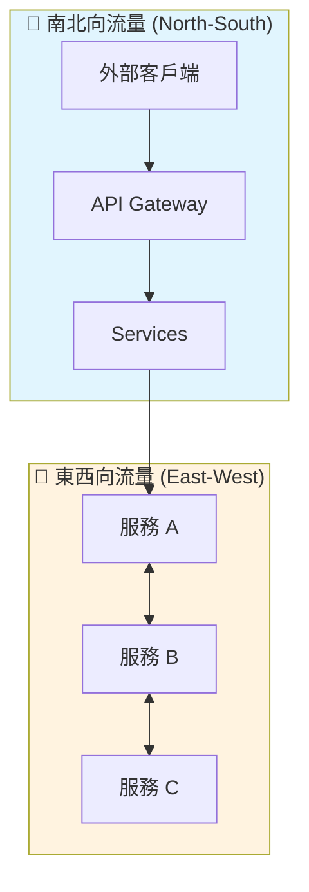

| 流量類型 | 方向 | 說明 | 安全重點 |
|----------|------|------|----------|
| **南北向** | 外部 → 內部 | 用戶/外部系統對 API 的請求 | API Gateway、WAF、限流 |
| **東西向** | 服務 ↔ 服務 | 微服務之間的內部通訊 | mTLS、Service Mesh |

## 6.2 API Gateway 安全

### Spring Cloud Gateway

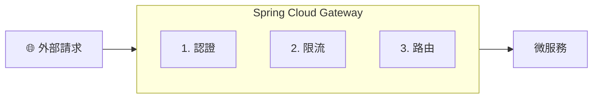

#### 配置範例

```yaml
# application.yml
spring:
  cloud:
    gateway:
      routes:
        - id: product-service
          uri: lb://product-service
          predicates:
            - Path=/api/products/**
          filters:
            # 1. Token 驗證
            - TokenRelay
            # 2. 限流
            - name: RequestRateLimiter
              args:
                redis-rate-limiter.replenishRate: 100
                redis-rate-limiter.burstCapacity: 200
            # 3. 移除敏感標頭
            - RemoveRequestHeader=Cookie
            - RemoveRequestHeader=Set-Cookie
```

#### 自訂認證過濾器

```java
@Component
public class JwtAuthenticationFilter implements GlobalFilter, Ordered {

    private final JwtService jwtService;

    @Override
    public Mono<Void> filter(ServerWebExchange exchange, GatewayFilterChain chain) {
        String path = exchange.getRequest().getURI().getPath();

        // 白名單路徑
        if (isPublicPath(path)) {
            return chain.filter(exchange);
        }

        // 驗證 Token
        String token = extractToken(exchange.getRequest());
        if (token == null || !jwtService.isValid(token)) {
            exchange.getResponse().setStatusCode(HttpStatus.UNAUTHORIZED);
            return exchange.getResponse().setComplete();
        }

        // 將用戶資訊傳遞給下游服務
        String userId = jwtService.extractUserId(token);
        ServerHttpRequest request = exchange.getRequest().mutate()
            .header("X-User-Id", userId)
            .build();

        return chain.filter(exchange.mutate().request(request).build());
    }

    @Override
    public int getOrder() {
        return -100;  // 優先執行
    }
}
```

### Kong Gateway

```yaml
# kong.yml - 聲明式配置
_format_version: "3.0"

services:
  - name: product-service
    url: http://product-service:8080
    routes:
      - name: product-route
        paths:
          - /api/products
    plugins:
      # 1. JWT 認證
      - name: jwt
        config:
          claims_to_verify:
            - exp

      # 2. 限流
      - name: rate-limiting
        config:
          minute: 1000
          policy: local

      # 3. IP 限制
      - name: ip-restriction
        config:
          allow:
            - 10.0.0.0/8
            - 192.168.0.0/16

      # 4. CORS
      - name: cors
        config:
          origins:
            - https://example.com
          methods:
            - GET
            - POST
          headers:
            - Authorization
            - Content-Type

consumers:
  - username: ecommerce-app
    jwt_secrets:
      - key: ecommerce-key
        secret: your-jwt-secret
```

### Apache APISIX

```yaml
# apisix.yaml
routes:
  - uri: /api/products/*
    upstream:
      type: roundrobin
      nodes:
        "product-service:8080": 1
    plugins:
      # 1. JWT 認證
      jwt-auth:
        key: "ecommerce-key"
        secret: "your-jwt-secret"

      # 2. 限流
      limit-req:
        rate: 100
        burst: 50
        key_type: "var"
        key: "remote_addr"

      # 3. 日誌
      http-logger:
        uri: "http://logging-service:9080/logs"

      # 4. 熔斷
      api-breaker:
        break_response_code: 503
        max_breaker_sec: 60
        unhealthy:
          http_statuses: [500, 502, 503]
          failures: 3
```

## 6.3 東西向安全 - Service Mesh

### mTLS (Mutual TLS)

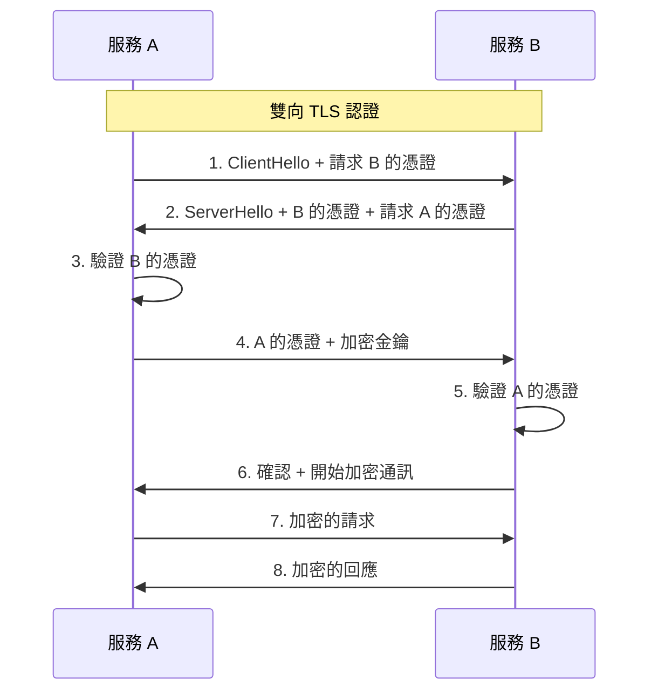

### Istio Service Mesh

```yaml
# 啟用 mTLS
apiVersion: security.istio.io/v1beta1
kind: PeerAuthentication
metadata:
  name: default
  namespace: ecommerce
spec:
  mtls:
    mode: STRICT  # 強制 mTLS

---
# 定義授權策略
apiVersion: security.istio.io/v1beta1
kind: AuthorizationPolicy
metadata:
  name: product-service-policy
  namespace: ecommerce
spec:
  selector:
    matchLabels:
      app: product-service
  rules:
    # 只允許特定服務存取
    - from:
        - source:
            principals:
              - cluster.local/ns/ecommerce/sa/order-service
              - cluster.local/ns/ecommerce/sa/inventory-service
      to:
        - operation:
            methods: ["GET", "POST"]
            paths: ["/api/products/*"]
```

## 6.4 完整架構圖

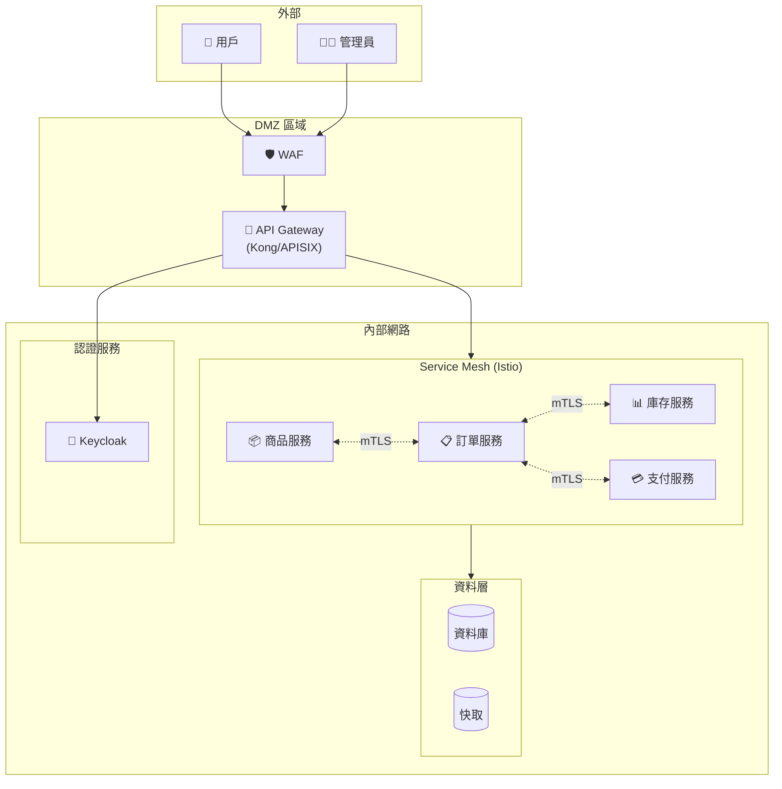

## 6.5 安全最佳實踐總結

### 南北向安全

| 層級 | 安全措施 | 工具 |
|------|----------|------|
| 網路邊界 | WAF、DDoS 防護 | Cloudflare, AWS WAF |
| API Gateway | 認證、限流、路由 | Kong, APISIX, Spring Cloud Gateway |
| 應用層 | 輸入驗證、CORS | Spring Security |

### 東西向安全

| 層級 | 安全措施 | 工具 |
|------|----------|------|
| 傳輸層 | mTLS 加密 | Istio, Linkerd |
| 服務層 | 服務間授權 | Istio AuthorizationPolicy |
| 應用層 | 內部 Token 驗證 | JWT, OAuth2 |

### 安全配置檢查清單

```
✅ 南北向
□ API Gateway 配置 JWT 驗證
□ 啟用 HTTPS/TLS
□ 配置限流防止 DDoS
□ 設定 CORS 策略
□ 啟用 WAF 規則

✅ 東西向
□ 啟用 Service Mesh mTLS
□ 配置服務間授權策略
□ 限制服務網路訪問範圍
□ 加密敏感設定檔

✅ 通用
□ 所有密碼使用強加密儲存
□ 定期輪換密鑰和憑證
□ 啟用審計日誌
□ 實施最小權限原則
```

---

## 參考資源

- [Spring Security 官方文件](https://docs.spring.io/spring-security/reference/)
- [Keycloak 官方文件](https://www.keycloak.org/documentation)
- [OAuth 2.0 RFC 6749](https://datatracker.ietf.org/doc/html/rfc6749)
- [JWT 官方網站](https://jwt.io/)
- [Kong Gateway 文件](https://docs.konghq.com/)
- [Apache APISIX 文件](https://apisix.apache.org/docs/)
- [Istio 安全指南](https://istio.io/latest/docs/concepts/security/)
