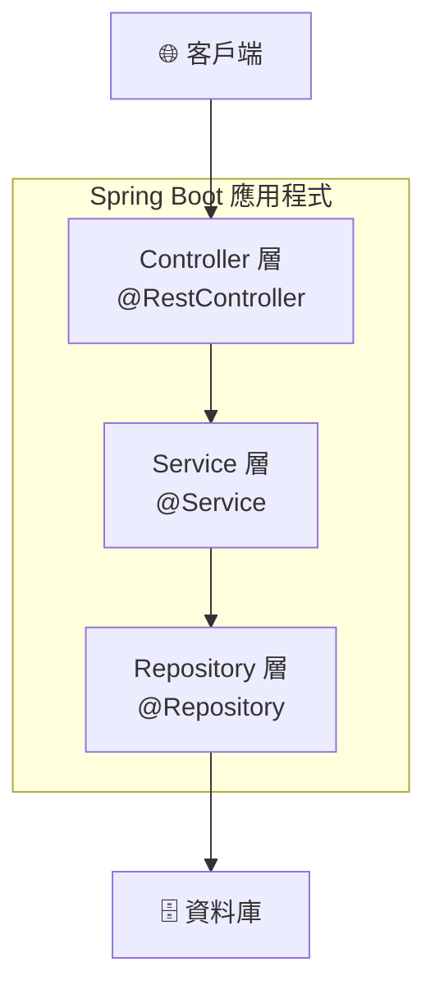

# Spring Boot Basics - 電子商務 REST API 範例

這個模組透過電子商務 REST API 範例，循序漸進地介紹 Spring Boot 的核心功能與開發實務。

---

## 教學目錄

1. [Spring Boot 概述](#第一章spring-boot-概述)
2. [IoC 與依賴注入](#第二章ioc-與依賴注入)
3. [分層架構](#第三章分層架構)
4. [REST API 開發](#第四章rest-api-開發)
5. [JPA 資料存取](#第五章jpa-資料存取)
6. [請求驗證](#第六章請求驗證)
7. [異常處理](#第七章異常處理)
8. [測試實作](#第八章測試實作)

---

# 第一章：Spring Boot 概述

## 1.1 什麼是 Spring Boot？

Spring Boot 是建立在 Spring Framework 之上的框架，透過「約定優於配置」的理念，讓開發者能快速建立生產級的 Spring 應用程式。

### Spring Framework vs Spring Boot

```
Spring Framework（2004）
├── 強大但配置繁瑣
├── 大量 XML 配置文件
├── 需要手動管理依賴版本
└── 部署需要外部應用伺服器

        ⬇️ 簡化

Spring Boot（2014）
├── 自動配置（Auto Configuration）
├── 內嵌伺服器（Tomcat/Jetty）
├── Starter 依賴（簡化依賴管理）
└── 生產就緒功能（監控、健康檢查）
```

## 1.2 Spring Boot 核心特性

### 自動配置 (Auto Configuration)

```java
// 傳統 Spring：需要手動配置 DataSource
@Configuration
public class DataSourceConfig {
    @Bean
    public DataSource dataSource() {
        HikariDataSource ds = new HikariDataSource();
        ds.setJdbcUrl("jdbc:mysql://localhost:3306/mydb");
        ds.setUsername("root");
        ds.setPassword("password");
        return ds;
    }
}

// Spring Boot：只需加入依賴和設定，自動配置完成！
// application.yml
spring:
  datasource:
    url: jdbc:mysql://localhost:3306/mydb
    username: root
    password: password
```

### Starter 依賴

```groovy
// 一個 Starter 包含所有相關依賴
dependencies {
    // Web 開發所需的所有依賴
    implementation 'org.springframework.boot:spring-boot-starter-web'

    // JPA 資料存取所需的所有依賴
    implementation 'org.springframework.boot:spring-boot-starter-data-jpa'
}
```

### 內嵌伺服器

```java
// 不需要外部 Tomcat，直接運行 main 方法即可啟動
@SpringBootApplication
public class Application {
    public static void main(String[] args) {
        SpringApplication.run(Application.class, args);
    }
}
```

---

# 第二章：IoC 與依賴注入

## 2.1 控制反轉 (Inversion of Control)

IoC 是一種設計原則，將物件的建立和管理權交給容器（Spring）。

### 傳統方式 vs IoC

```java
// ❌ 傳統方式：自己 new 物件
public class OrderService {
    private ProductRepository productRepository = new ProductRepository();
    private PaymentService paymentService = new PaymentService();

    // 問題：
    // 1. 強耦合，難以測試
    // 2. 無法輕易替換實作
}

// ✅ IoC 方式：由容器注入
@Service
public class OrderService {
    private final ProductRepository productRepository;
    private final PaymentService paymentService;

    // 建構子注入（推薦）
    public OrderService(ProductRepository productRepository,
                        PaymentService paymentService) {
        this.productRepository = productRepository;
        this.paymentService = paymentService;
    }

    // 優點：
    // 1. 鬆耦合，易於測試
    // 2. 可以輕易替換實作（如 Mock）
}
```

## 2.2 Bean 與組件掃描

Spring 管理的物件稱為 **Bean**。透過組件掃描自動發現和註冊 Bean。

```java
// @SpringBootApplication 包含 @ComponentScan
// 會自動掃描同套件及子套件下的所有組件
@SpringBootApplication
public class ECommerceApplication {
    public static void main(String[] args) {
        SpringApplication.run(ECommerceApplication.class, args);
    }
}
```

### 組件註解

```java
@Component      // 通用組件
@Service        // 業務邏輯層（語義化的 @Component）
@Repository     // 資料存取層（語義化的 @Component + 例外轉換）
@Controller     // Web 控制器
@RestController // REST API 控制器（@Controller + @ResponseBody）
@Configuration  // 配置類
```

## 2.3 依賴注入方式

### 建構子注入（推薦）

```java
@Service
public class ProductService {
    private final ProductRepository productRepository;

    // 當只有一個建構子時，@Autowired 可省略
    public ProductService(ProductRepository productRepository) {
        this.productRepository = productRepository;
    }
}
```

### 欄位注入

```java
@Service
public class ProductService {
    @Autowired
    private ProductRepository productRepository;

    // 缺點：無法宣告為 final，不利於測試
}
```

### Setter 注入

```java
@Service
public class ProductService {
    private ProductRepository productRepository;

    @Autowired
    public void setProductRepository(ProductRepository productRepository) {
        this.productRepository = productRepository;
    }
}
```

---

# 第三章：分層架構

## 3.1 三層式架構



### 各層職責

| 層級 | 職責 | 註解 |
|------|------|------|
| **Controller** | 接收請求、回傳回應、參數驗證 | @RestController |
| **Service** | 業務邏輯、事務管理 | @Service |
| **Repository** | 資料存取、CRUD 操作 | @Repository |

## 3.2 DTO 與 Entity

```java
// Entity - 對應資料庫表
@Entity
@Table(name = "products")
public class Product {
    @Id
    @GeneratedValue(strategy = GenerationType.IDENTITY)
    private Long id;
    private String name;
    private BigDecimal price;
    // ... 其他欄位
}

// DTO - 資料傳輸物件（API 請求/回應）
public class ProductDTO {
    private Long id;
    private String name;
    private String formattedPrice;  // 格式化後的價格
    // ... 只包含需要的欄位
}

// 為什麼需要 DTO？
// 1. 隱藏敏感資料（如密碼）
// 2. 減少傳輸資料量
// 3. 解耦 API 與資料庫結構
```

---

# 第四章：REST API 開發

## 4.1 RESTful API 設計原則

```
資源導向：使用名詞表示資源
GET    /api/v1/products        取得所有商品
GET    /api/v1/products/{id}   取得單一商品
POST   /api/v1/products        建立商品
PUT    /api/v1/products/{id}   完整更新商品
PATCH  /api/v1/products/{id}   部分更新商品
DELETE /api/v1/products/{id}   刪除商品
```

## 4.2 Controller 實作

```java
@RestController
@RequestMapping("/api/v1/products")
public class ProductController {

    private final ProductService productService;

    public ProductController(ProductService productService) {
        this.productService = productService;
    }

    // GET /api/v1/products
    @GetMapping
    public ResponseEntity<Page<ProductDTO>> getAllProducts(
            @RequestParam(defaultValue = "0") int page,
            @RequestParam(defaultValue = "10") int size) {
        return ResponseEntity.ok(productService.getAllProducts(page, size));
    }

    // GET /api/v1/products/{id}
    @GetMapping("/{id}")
    public ResponseEntity<ProductDTO> getProduct(@PathVariable Long id) {
        return ResponseEntity.ok(productService.getProductById(id));
    }

    // POST /api/v1/products
    @PostMapping
    public ResponseEntity<ProductDTO> createProduct(
            @Valid @RequestBody CreateProductRequest request) {
        ProductDTO created = productService.createProduct(request);
        return ResponseEntity.status(HttpStatus.CREATED).body(created);
    }

    // PUT /api/v1/products/{id}
    @PutMapping("/{id}")
    public ResponseEntity<ProductDTO> updateProduct(
            @PathVariable Long id,
            @Valid @RequestBody UpdateProductRequest request) {
        return ResponseEntity.ok(productService.updateProduct(id, request));
    }

    // DELETE /api/v1/products/{id}
    @DeleteMapping("/{id}")
    public ResponseEntity<Void> deleteProduct(@PathVariable Long id) {
        productService.deleteProduct(id);
        return ResponseEntity.noContent().build();
    }
}
```

## 4.3 常用註解說明

| 註解 | 用途 | 範例 |
|------|------|------|
| `@PathVariable` | 從 URL 路徑取值 | `/products/{id}` → `@PathVariable Long id` |
| `@RequestParam` | 從查詢參數取值 | `/products?page=1` → `@RequestParam int page` |
| `@RequestBody` | 將請求 Body 轉為物件 | JSON → Java Object |
| `@Valid` | 觸發參數驗證 | 搭配 Bean Validation 使用 |

---

# 第五章：JPA 資料存取

## 5.1 Entity 定義

```java
@Entity
@Table(name = "products")
public class Product {

    @Id
    @GeneratedValue(strategy = GenerationType.IDENTITY)
    private Long id;

    @Column(nullable = false, length = 200)
    private String name;

    @Column(precision = 10, scale = 2)
    private BigDecimal price;

    @Column(columnDefinition = "TEXT")
    private String description;

    @ManyToOne(fetch = FetchType.LAZY)
    @JoinColumn(name = "category_id")
    private Category category;

    @CreatedDate
    @Column(name = "created_at", updatable = false)
    private LocalDateTime createdAt;

    // getters and setters
}
```

## 5.2 Repository 介面

```java
@Repository
public interface ProductRepository extends JpaRepository<Product, Long> {

    // 方法名稱查詢
    List<Product> findByNameContaining(String keyword);

    List<Product> findByPriceBetween(BigDecimal min, BigDecimal max);

    Optional<Product> findByNameIgnoreCase(String name);

    // JPQL 查詢
    @Query("SELECT p FROM Product p WHERE p.category.name = :categoryName")
    List<Product> findByCategoryName(@Param("categoryName") String categoryName);

    // 原生 SQL 查詢
    @Query(value = "SELECT * FROM products WHERE stock > 0", nativeQuery = true)
    List<Product> findInStockProducts();
}
```

## 5.3 JpaRepository 常用方法

| 方法 | 說明 |
|------|------|
| `save(entity)` | 新增或更新 |
| `findById(id)` | 依 ID 查詢 |
| `findAll()` | 查詢全部 |
| `findAll(Pageable)` | 分頁查詢 |
| `deleteById(id)` | 依 ID 刪除 |
| `count()` | 計算筆數 |
| `existsById(id)` | 檢查是否存在 |

---

# 第六章：請求驗證

## 6.1 Bean Validation

```java
public class CreateProductRequest {

    @NotBlank(message = "商品名稱不能為空")
    @Size(max = 200, message = "商品名稱不能超過 200 字元")
    private String name;

    @NotNull(message = "價格不能為空")
    @Positive(message = "價格必須為正數")
    private BigDecimal price;

    @Size(max = 1000, message = "描述不能超過 1000 字元")
    private String description;

    // getters and setters
}
```

## 6.2 常用驗證註解

| 註解 | 說明 |
|------|------|
| `@NotNull` | 不能為 null |
| `@NotBlank` | 不能為 null 且不能是空白字串 |
| `@NotEmpty` | 不能為 null 且不能是空集合 |
| `@Size(min, max)` | 字串/集合長度範圍 |
| `@Min` / `@Max` | 數值最小/最大值 |
| `@Positive` | 必須為正數 |
| `@Email` | 必須是有效的 Email |
| `@Pattern` | 符合正則表達式 |

## 6.3 在 Controller 使用驗證

```java
@PostMapping
public ResponseEntity<ProductDTO> createProduct(
        @Valid @RequestBody CreateProductRequest request) {
    // @Valid 觸發驗證，驗證失敗會拋出 MethodArgumentNotValidException
    return ResponseEntity.ok(productService.createProduct(request));
}
```

---

# 第七章：異常處理

## 7.1 自定義例外

```java
// 商品不存在例外
public class ProductNotFoundException extends RuntimeException {
    public ProductNotFoundException(Long id) {
        super("商品不存在：ID = " + id);
    }
}

// 業務邏輯例外
public class BusinessException extends RuntimeException {
    private final String errorCode;

    public BusinessException(String errorCode, String message) {
        super(message);
        this.errorCode = errorCode;
    }
}
```

## 7.2 全域異常處理

```java
@RestControllerAdvice
public class GlobalExceptionHandler {

    // 處理資源不存在
    @ExceptionHandler(ProductNotFoundException.class)
    public ResponseEntity<ErrorResponse> handleNotFound(ProductNotFoundException ex) {
        ErrorResponse error = new ErrorResponse("NOT_FOUND", ex.getMessage());
        return ResponseEntity.status(HttpStatus.NOT_FOUND).body(error);
    }

    // 處理驗證失敗
    @ExceptionHandler(MethodArgumentNotValidException.class)
    public ResponseEntity<ErrorResponse> handleValidation(MethodArgumentNotValidException ex) {
        Map<String, String> errors = new HashMap<>();
        ex.getBindingResult().getFieldErrors().forEach(error ->
            errors.put(error.getField(), error.getDefaultMessage())
        );

        ErrorResponse error = new ErrorResponse("VALIDATION_FAILED", "輸入資料驗證失敗");
        error.setDetails(errors);
        return ResponseEntity.badRequest().body(error);
    }

    // 處理其他未預期例外
    @ExceptionHandler(Exception.class)
    public ResponseEntity<ErrorResponse> handleGeneral(Exception ex) {
        ErrorResponse error = new ErrorResponse("INTERNAL_ERROR", "系統發生錯誤");
        return ResponseEntity.status(HttpStatus.INTERNAL_SERVER_ERROR).body(error);
    }
}
```

## 7.3 統一錯誤回應格式

```java
@Data
@AllArgsConstructor
public class ErrorResponse {
    private String code;
    private String message;
    private LocalDateTime timestamp = LocalDateTime.now();
    private Map<String, String> details;
}
```

---

# 第八章：測試實作

## 8.1 測試金字塔

```
         /\
        /  \      E2E 測試（少量）
       /────\
      /      \    整合測試
     /────────\
    /          \  單元測試（大量）
   /────────────\
```

## 8.2 單元測試

```java
@ExtendWith(MockitoExtension.class)
class ProductServiceTest {

    @Mock
    private ProductRepository productRepository;

    @InjectMocks
    private ProductService productService;

    @Test
    @DisplayName("根據 ID 查詢商品 - 成功")
    void getProductById_Success() {
        // Arrange
        Product product = new Product();
        product.setId(1L);
        product.setName("測試商品");
        when(productRepository.findById(1L)).thenReturn(Optional.of(product));

        // Act
        ProductDTO result = productService.getProductById(1L);

        // Assert
        assertNotNull(result);
        assertEquals("測試商品", result.getName());
        verify(productRepository).findById(1L);
    }

    @Test
    @DisplayName("根據 ID 查詢商品 - 商品不存在")
    void getProductById_NotFound() {
        // Arrange
        when(productRepository.findById(999L)).thenReturn(Optional.empty());

        // Act & Assert
        assertThrows(ProductNotFoundException.class,
            () -> productService.getProductById(999L));
    }
}
```

## 8.3 Controller 測試

```java
@WebMvcTest(ProductController.class)
class ProductControllerTest {

    @Autowired
    private MockMvc mockMvc;

    @MockBean
    private ProductService productService;

    @Test
    @DisplayName("GET /api/v1/products/{id} - 成功")
    void getProduct_Success() throws Exception {
        // Arrange
        ProductDTO product = new ProductDTO(1L, "iPhone", new BigDecimal("35900"));
        when(productService.getProductById(1L)).thenReturn(product);

        // Act & Assert
        mockMvc.perform(get("/api/v1/products/1"))
            .andExpect(status().isOk())
            .andExpect(jsonPath("$.id").value(1))
            .andExpect(jsonPath("$.name").value("iPhone"));
    }
}
```

## 8.4 Repository 測試

```java
@DataJpaTest
class ProductRepositoryTest {

    @Autowired
    private ProductRepository productRepository;

    @Test
    @DisplayName("依名稱搜尋商品")
    void findByNameContaining() {
        // Arrange
        Product product = new Product();
        product.setName("iPhone 15 Pro");
        product.setPrice(new BigDecimal("35900"));
        productRepository.save(product);

        // Act
        List<Product> results = productRepository.findByNameContaining("iPhone");

        // Assert
        assertThat(results).hasSize(1);
        assertThat(results.get(0).getName()).contains("iPhone");
    }
}
```

---

## 專案結構

```
spring-boot-basics/
├── src/main/java/com/ecommerce/
│   ├── ECommerceApplication.java    # 應用程式進入點
│   ├── config/                      # 配置類
│   │   ├── DataInitializer.java     # 資料初始化
│   │   └── OpenApiConfig.java       # Swagger 配置
│   ├── controller/                  # REST 控制器
│   │   ├── ProductController.java   # 商品 API
│   │   └── OrderController.java     # 訂單 API
│   ├── dto/                         # 資料傳輸物件
│   ├── entity/                      # JPA 實體
│   │   ├── BaseEntity.java          # 基礎實體（ID、時間戳）
│   │   ├── Category.java            # 分類
│   │   ├── Product.java             # 商品
│   │   ├── Order.java               # 訂單
│   │   └── OrderItem.java           # 訂單項目
│   ├── exception/                   # 異常處理
│   ├── repository/                  # 資料存取層
│   └── service/                     # 業務邏輯層
└── src/test/java/                   # 測試程式碼
```

---

## 執行方式

```bash
# 從根目錄執行
./gradlew :spring-boot-basics:bootRun

# 或進入模組目錄
cd spring-boot-basics
../gradlew bootRun
```

---

## API 端點

應用程式啟動後，可透過以下方式存取：

- **Swagger UI**: http://localhost:8080/swagger-ui.html
- **H2 Console**: http://localhost:8080/h2-console
- **API 文檔**: http://localhost:8080/api-docs

### 商品 API

| 方法 | 路徑 | 說明 |
|------|------|------|
| GET | `/api/v1/products` | 取得商品列表（分頁） |
| GET | `/api/v1/products/{id}` | 取得單一商品 |
| POST | `/api/v1/products` | 建立商品 |
| PUT | `/api/v1/products/{id}` | 更新商品 |
| DELETE | `/api/v1/products/{id}` | 刪除商品 |
| GET | `/api/v1/products/search` | 搜尋商品 |

### 訂單 API

| 方法 | 路徑 | 說明 |
|------|------|------|
| GET | `/api/v1/orders/{id}` | 取得訂單詳情 |
| POST | `/api/v1/orders` | 建立訂單 |
| PUT | `/api/v1/orders/{id}/status` | 更新訂單狀態 |
| POST | `/api/v1/orders/{id}/cancel` | 取消訂單 |

---

## 測試

```bash
# 執行所有測試
./gradlew :spring-boot-basics:test

# 執行特定測試類
./gradlew :spring-boot-basics:test --tests "*ProductServiceTest*"
```

---

## 相關資源

- [返回專案根目錄](../README.md)
- [Spring Security 模組](../spring-security-demo/README.md)
- [Annotation 參考手冊](../SPRING_ANNOTATIONS.md)
